# Pregunta 4: Diagrama de Containers C4 Model para ASB GlassFloor Platform (5 puntos)

## Elabore un diagrama de Containers de C4 Model para su propuesta de ASB GlassFloor Platform. Explique y sustente sus decisiones de diseño.

---

## DIAGRAMA DE CONTAINERS - ASB GLASSFLOOR PLATFORM

```mermaid
graph TB
    subgraph "👥 USUARIOS Y SISTEMAS EXTERNOS"
        U1[👤 Atletas/Jugadores<br/>📱 Mobile App]
        U2[👤 Entrenadores<br/>💻 Tablet/Laptop]
        U3[👤 Operadores<br/>🖥️ Control Console]
        U4[👤 Espectadores<br/>📱 Fan App]
        U5[👤 Directivos<br/>📊 Executive Dashboard]
        
        EXT1[🎯 Hawk-Eye System<br/>📡 External Tracking API]
        EXT2[📊 ShotTracker<br/>📡 Sensor Network API]
        EXT3[🌤️ Weather API<br/>📡 External Data Service]
        EXT4[📧 Notification Services<br/>📡 SendGrid/AWS SES]
    end

    subgraph "🌐 PRESENTATION LAYER"
        WEB1[🌐 Web Portal<br/>React.js + TypeScript<br/>Responsive Dashboard UI]
        MOB1[📱 Mobile App<br/>Flutter/React Native<br/>Real-time Sports Analytics]
        MOB2[📱 Fan Engagement App<br/>React Native<br/>Gamification & Stats]
        TAB1[💻 Coach Tablet Interface<br/>Custom Sports App<br/>Tactical Drawing Tools]
    end

    subgraph "🚪 API GATEWAY LAYER"
        API1[🚪 Main API Gateway<br/>Kong/AWS API Gateway<br/>Rate Limiting, Auth, Routing]
        WS1[🔄 WebSocket Gateway<br/>Node.js + Socket.io<br/>Real-time Data Streaming]
    end

    subgraph "⚙️ MICROSERVICES LAYER"
        MS1[👤 User Management Service<br/>Node.js + Express<br/>Authentication & Authorization]
        
        MS2[🎯 Player Tracking Service<br/>Python + FastAPI<br/>Multi-sensor Data Fusion]
        
        MS3[📊 Analytics Engine<br/>Python + Pandas/NumPy<br/>Real-time Sports Analytics]
        
        MS4[🎨 Content Management Service<br/>Node.js + Express<br/>LED Content & Layouts]
        
        MS5[🔔 Notification Service<br/>Python + Celery<br/>Multi-channel Alerts]
        
        MS6[🎮 Game State Service<br/>Go/Rust<br/>Real-time Game Logic]
        
        MS7[📹 Video Analysis Service<br/>Python + OpenCV<br/>Computer Vision Pipeline]
        
        MS8[🏟️ Venue Management Service<br/>Java Spring Boot<br/>Facility & Event Management]
    end

    subgraph "🤖 AI/ML PROCESSING LAYER"
        AI1[🧠 ML Inference Engine<br/>Python + TensorFlow/PyTorch<br/>Real-time Model Serving]
        AI2[👁️ Computer Vision Pipeline<br/>C++ + OpenCV + CUDA<br/>High-speed Object Detection]
        AI3[📈 Predictive Analytics<br/>Python + Scikit-learn<br/>Performance Prediction Models]
    end

    subgraph "💾 DATA LAYER"
        DB1[📈 Time Series Database<br/>InfluxDB/TimescaleDB<br/>Sensor Data Storage]
        
        DB2[🗄️ Operational Database<br/>PostgreSQL<br/>Users, Config, Events]
        
        DB3[📊 Analytics Database<br/>ClickHouse/BigQuery<br/>Historical Analytics]
        
        DB4[🚀 Cache Layer<br/>Redis Cluster<br/>Session & Fast Data Access]
        
        DB5[📁 Object Storage<br/>AWS S3/MinIO<br/>Videos, Images, Backups]
    end

    subgraph "📨 MESSAGE QUEUE LAYER"
        MQ1[📨 Message Broker<br/>Apache Kafka<br/>High-throughput Event Streaming]
        MQ2[⚡ Task Queue<br/>Redis + Celery<br/>Async Processing Tasks]
    end

    subgraph "🔧 EDGE COMPUTING LAYER"
        EDGE1[⚡ Edge Node 1<br/>Ubuntu + Docker<br/>Video Processing & CV]
        EDGE2[⚡ Edge Node 2<br/>Ubuntu + Docker<br/>Sensor Fusion & Tracking]
        EDGE3[⚡ Edge Node 3<br/>Ubuntu + Docker<br/>LED Control & Rendering]
        EDGE4[⚡ Edge Node Backup<br/>Ubuntu + Docker<br/>Failover & Load Balancing]
    end

    subgraph "🏟️ HARDWARE INTEGRATION LAYER"
        HW1[💡 LED Controller Network<br/>Custom Firmware<br/>High-frequency LED Matrix Control]
        HW2[📹 Camera Network<br/>GigE Vision Protocol<br/>Multi-camera Synchronization]
        HW3[📡 Sensor Network<br/>LoRa/BLE/UWB<br/>Wearable & Environment Sensors]
        HW4[🔌 Power Management<br/>SCADA System<br/>Energy Monitoring & Control]
    end

    subgraph "☁️ CLOUD SERVICES LAYER"
        CLOUD1[☁️ Data Warehouse<br/>AWS Redshift/Snowflake<br/>Historical Data Analytics]
        CLOUD2[☁️ ML Training Platform<br/>AWS SageMaker/GCP AI<br/>Model Training & Optimization]
        CLOUD3[☁️ Backup & DR<br/>AWS S3 Glacier<br/>Long-term Storage & Disaster Recovery]
    end

    %% Conexiones Usuarios
    U1 -.->|HTTPS/WSS| MOB1
    U2 -.->|HTTPS/WSS| TAB1
    U3 -.->|HTTPS/WSS| WEB1
    U4 -.->|HTTPS| MOB2
    U5 -.->|HTTPS| WEB1

    %% Conexiones APIs Externas
    EXT1 -.->|REST API| MS2
    EXT2 -.->|REST API| MS2
    EXT3 -.->|REST API| MS5
    EXT4 -.->|SMTP/API| MS5

    %% Conexiones Frontend a Gateway
    WEB1 -->|HTTPS| API1
    MOB1 -->|HTTPS| API1
    MOB2 -->|HTTPS| API1
    TAB1 -->|HTTPS| API1
    
    MOB1 -->|WebSocket| WS1
    TAB1 -->|WebSocket| WS1
    WEB1 -->|WebSocket| WS1

    %% Gateway a Microservicios
    API1 -->|HTTP| MS1
    API1 -->|HTTP| MS2
    API1 -->|HTTP| MS3
    API1 -->|HTTP| MS4
    API1 -->|HTTP| MS5
    API1 -->|HTTP| MS6
    API1 -->|HTTP| MS7
    API1 -->|HTTP| MS8

    WS1 -->|TCP| MS2
    WS1 -->|TCP| MS3
    WS1 -->|TCP| MS6

    %% Microservicios a AI/ML
    MS2 -->|gRPC| AI1
    MS3 -->|gRPC| AI1
    MS7 -->|gRPC| AI2
    MS3 -->|HTTP| AI3

    %% Microservicios a Datos
    MS1 -->|SQL| DB2
    MS2 -->|InfluxQL| DB1
    MS3 -->|SQL| DB3
    MS4 -->|SQL| DB2
    MS5 -->|SQL| DB2
    MS6 -->|Redis Protocol| DB4
    MS7 -->|S3 API| DB5
    MS8 -->|SQL| DB2

    %% Message Queues
    MS2 -->|Kafka Protocol| MQ1
    MS3 -->|Kafka Protocol| MQ1
    MS5 -->|Celery Protocol| MQ2
    MS7 -->|Kafka Protocol| MQ1

    %% Edge Computing
    EDGE1 -->|gRPC| AI2
    EDGE1 -->|TCP| MQ1
    EDGE2 -->|HTTP| MS2
    EDGE2 -->|TCP| MQ1
    EDGE3 -->|HTTP| MS4
    EDGE3 -->|TCP| MQ1
    EDGE4 -->|HTTP| MS6

    %% Hardware Integration
    EDGE1 -->|GigE Vision| HW2
    EDGE2 -->|LoRa/BLE/UWB| HW3
    EDGE3 -->|Ethernet/Custom| HW1
    EDGE4 -->|SCADA/Modbus| HW4

    %% Cloud Services
    DB1 -->|ETL Pipeline| CLOUD1
    DB3 -->|Data Pipeline| CLOUD1
    AI1 -->|Model Sync| CLOUD2
    DB5 -->|Replication| CLOUD3

    %% Estilos
    classDef userStyle fill:#e1f5fe,stroke:#01579b,stroke-width:2px,color:#000
    classDef frontendStyle fill:#f3e5f5,stroke:#4a148c,stroke-width:2px,color:#000
    classDef gatewayStyle fill:#fff3e0,stroke:#e65100,stroke-width:2px,color:#000
    classDef serviceStyle fill:#e8f5e8,stroke:#1b5e20,stroke-width:2px,color:#000
    classDef aiStyle fill:#fce4ec,stroke:#880e4f,stroke-width:2px,color:#000
    classDef dataStyle fill:#e3f2fd,stroke:#0d47a1,stroke-width:2px,color:#000
    classDef edgeStyle fill:#fff8e1,stroke:#f57f17,stroke-width:2px,color:#000
    classDef hardwareStyle fill:#efebe9,stroke:#3e2723,stroke-width:2px,color:#000
    classDef cloudStyle fill:#f1f8e9,stroke:#33691e,stroke-width:2px,color:#000
    classDef externalStyle fill:#fafafa,stroke:#424242,stroke-width:2px,color:#000

    class U1,U2,U3,U4,U5 userStyle
    class WEB1,MOB1,MOB2,TAB1 frontendStyle
    class API1,WS1 gatewayStyle
    class MS1,MS2,MS3,MS4,MS5,MS6,MS7,MS8 serviceStyle
    class AI1,AI2,AI3 aiStyle
    class DB1,DB2,DB3,DB4,DB5,MQ1,MQ2 dataStyle
    class EDGE1,EDGE2,EDGE3,EDGE4 edgeStyle
    class HW1,HW2,HW3,HW4 hardwareStyle
    class CLOUD1,CLOUD2,CLOUD3 cloudStyle
    class EXT1,EXT2,EXT3,EXT4 externalStyle
```

---

## JUSTIFICACIÓN Y SUSTENTACIÓN DE DECISIONES DE DISEÑO

### 1. **ARQUITECTURA DE MICROSERVICIOS DISTRIBUIDA**

#### **Decisión**: Implementar una arquitectura de microservicios en lugar de un monolito
**Justificación**:
- **Escalabilidad independiente**: Cada servicio puede escalar según su carga específica (ej: tracking service necesita más recursos durante partidos)
- **Tolerancia a fallos**: Si un servicio falla, no compromete todo el sistema
- **Tecnología heterogénea**: Permite usar el lenguaje/framework más adecuado para cada función específica
- **Desarrollo paralelo**: Múltiples equipos pueden trabajar independientemente

**Sustentación técnica**:
- **Player Tracking Service** en Python: Ideal para algoritmos de ML y procesamiento numérico
- **Game State Service** en Go/Rust: Máximo rendimiento para lógica de tiempo real
- **User Management** en Node.js: Ecosistema maduro para authentication/authorization

### 2. **CAPA DE EDGE COMPUTING DISTRIBUIDA**

#### **Decisión**: Implementar múltiples Edge Nodes especializados
**Justificación según el caso**:
- **Latencia crítica**: El caso requiere <100ms end-to-end, impossible sin procesamiento local
- **Ancho de banda**: Procesar 8-16 streams de video (240-1000 fps) localmente evita saturar la red
- **Confiabilidad**: Redundancia activa con failover automático para eventos en vivo
- **Compliance con requisitos**: El caso especifica necesidad de múltiples Edge nodes para aplicaciones avanzadas

**Distribución especializada**:
- **Edge Node 1**: Computer Vision (GPU-intensive)
- **Edge Node 2**: Sensor Fusion (CPU-intensive, algoritmos Kalman)
- **Edge Node 3**: LED Rendering (GPU + network intensive)
- **Edge Node 4**: Backup/Load Balancing (redundancia)

### 3. **SEPARACIÓN DE CAPAS DE DATOS ESPECIALIZADAS**

#### **Decisión**: Usar diferentes tipos de bases de datos según el patrón de acceso
**Justificación técnica**:

**Time Series Database (InfluxDB)**:
- **Caso de uso**: 500Hz de datos de sensores × 24 jugadores = 12,000 writes/segundo
- **Optimización**: Compresión automática y retención de datos por tiempo
- **Query performance**: Consultas de agregación temporal muy eficientes

**Operational Database (PostgreSQL)**:
- **Caso de uso**: Datos transaccionales (usuarios, configuraciones, eventos)
- **ACID compliance**: Garantiza consistencia en operaciones críticas
- **Relational model**: Ideal para datos estructurados con referencias

**Analytics Database (ClickHouse)**:
- **Caso de uso**: Consultas OLAP sobre grandes volúmenes históricos
- **Columnar storage**: Análisis eficiente de métricas específicas
- **Parallel processing**: Queries complejas sobre múltiples temporadas

### 4. **GATEWAY LAYER CON SEPARACIÓN DE RESPONSABILIDADES**

#### **Decisión**: API Gateway + WebSocket Gateway separados
**Justificación**:

**API Gateway (Kong/AWS API Gateway)**:
- **Request/Response patterns**: REST APIs para operaciones CRUD
- **Rate limiting**: Protección contra abuso de APIs
- **Authentication/Authorization**: JWT tokens y OAuth integration
- **Load balancing**: Distribución inteligente entre microservicios

**WebSocket Gateway (Node.js + Socket.io)**:
- **Real-time requirements**: Streaming de datos de sensores <100ms
- **Bi-directional communication**: Coaches drawing en tiempo real
- **Connection management**: Manejo eficiente de múltiples conexiones simultáneas
- **Event-driven architecture**: Push de notificaciones instantáneas

### 5. **INTEGRACIÓN CON SISTEMAS EXTERNOS MEDIANTE APIs**

#### **Decisión**: Wrappers específicos para cada sistema externo
**Justificación según el caso**:
- **Hawk-Eye Integration**: El caso menciona integración con sistemas ópticos existentes
- **ShotTracker Partnership**: Colaboración específica mencionada en el enunciado
- **Vendor Independence**: Capacidad de integrar cualquier sistema de tracking
- **Data normalization**: Transformación a formato estándar interno

**Pattern implementado**:
- **Adapter Pattern**: Cada sistema externo tiene su adapter específico
- **Circuit Breaker**: Protección contra fallos de sistemas externos
- **Data validation**: Verificación de calidad de datos antes de procesamiento

### 6. **ARQUITECTURA DE MENSAJERÍA HÍBRIDA**

#### **Decisión**: Kafka para streaming + Redis/Celery para tasks
**Justificación técnica**:

**Apache Kafka para Event Streaming**:
- **High throughput**: 500Hz × 24 jugadores × múltiples métricas
- **Durability**: Replay de eventos para debugging y análisis
- **Scalability**: Partitioning automático para distribución de carga
- **Real-time processing**: Stream processing con Apache Flink

**Redis + Celery para Task Queue**:
- **Async processing**: Tareas no críticas (reportes, notificaciones)
- **Priority queues**: Diferentes prioridades según urgencia
- **Retry logic**: Manejo automático de fallos temporales
- **Monitoring**: Visibilidad completa de estado de tareas

### 7. **FRONTEND ESPECIALIZADO POR USUARIO**

#### **Decisión**: Aplicaciones específicas por tipo de usuario
**Justificación basada en requisitos**:

**Coach Tablet Interface**:
- **Tactical drawing**: Herramientas especializadas para dibujar jugadas
- **Real-time control**: Control directo del sistema LED
- **High-performance rendering**: Visualización fluida de datos tácticos

**Fan Engagement App**:
- **Gamification**: Mini-juegos y contenido interactivo
- **Social features**: Compartir estadísticas y momentos
- **Lightweight**: Optimizada para uso masivo simultáneo

**Executive Dashboard**:
- **Business metrics**: ROI, utilización, costos operativos
- **Long-term trends**: Analytics de múltiples temporadas
- **Export capabilities**: Reportes para stakeholders

### 8. **CLOUD INTEGRATION PARA CAPACIDADES AVANZADAS**

#### **Decisión**: Hybrid cloud para ML training y data warehousing
**Justificación estratégica**:

**Edge-first architecture**:
- **Real-time processing**: Todo el processing crítico permanece local
- **Low latency**: Cumple requisitos de <100ms
- **Reliability**: Funciona sin conectividad a internet

**Cloud augmentation**:
- **ML model training**: Recursos computacionales para entrenar modelos complejos
- **Historical analytics**: Análisis de tendencias de múltiples venues
- **Disaster recovery**: Backup automático y recuperación

### 9. **CONSIDERACIONES DE SEGURIDAD Y MONITOREO**

#### **Decisiones transversales**:

**Network Security**:
- **VPN tunnels**: Conectividad segura entre edge y cloud
- **Network segmentation**: Aislamiento entre capas críticas
- **Firewall rules**: Restricción de tráfico por protocolo y puerto

**Application Security**:
- **JWT tokens**: Autenticación stateless y escalable
- **Rate limiting**: Protección contra ataques DDoS
- **Input validation**: Sanitización de todos los datos de entrada

**Monitoring & Observability**:
- **Distributed tracing**: Jaeger para debugging de requests distribuidos
- **Metrics collection**: Prometheus + Grafana para monitoreo en tiempo real
- **Log aggregation**: ELK stack para análisis de logs centralizados

---

## BENEFICIOS DE ESTA ARQUITECTURA

### **1. Cumplimiento de Requisitos Críticos**
- ✅ **Latencia <100ms**: Edge computing + optimized data flow
- ✅ **Escalabilidad**: Microservicios + horizontal scaling
- ✅ **Confiabilidad 99.9%+**: Redundancia en todos los niveles críticos
- ✅ **Integración múltiple**: Adapter pattern para cualquier sistema externo

### **2. Flexibilidad Operacional**
- **Multi-sport**: Configuración dinámica para diferentes deportes
- **Multi-venue**: Replicación de arquitectura en múltiples instalaciones
- **Vendor independence**: No lock-in con proveedores específicos

### **3. Escalabilidad Técnica y de Negocio**
- **Performance scaling**: Edge nodes adicionales según demanda
- **Feature scaling**: Microservicios independientes para nuevas funcionalidades
- **Geographic scaling**: Replicación en múltiples regiones/países

### **4. Mantenimiento y Evolución**
- **Independent deployments**: Updates sin downtime del sistema completo
- **Technology evolution**: Migración gradual de tecnologías por servicio
- **A/B testing**: Experimentación segura en servicios específicos
