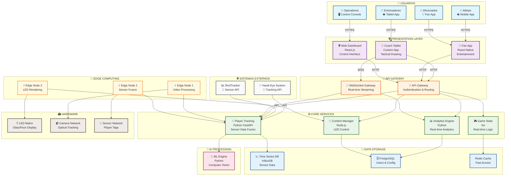

# Pregunta 4: Diagrama de Containers C4 Model para ASB GlassFloor Platform (5 puntos)

## Elabore un diagrama de Containers de C4 Model para su propuesta de ASB GlassFloor Platform. Explique y sustente sus decisiones de diseño.

---

## DIAGRAMA DE CONTAINERS - ASB GLASSFLOOR PLATFORM

---

## JUSTIFICACIÓN DE DECISIONES DE DISEÑO

### 1. **ARQUITECTURA DE MICROSERVICIOS**
**Decisión**: Separar funcionalidades en servicios independientes
**Justificación**:
- **Player Tracking Service**: Maneja integración con Hawk-Eye y ShotTracker (enunciado)
- **Analytics Engine**: Procesa métricas en tiempo real para entrenadores (enunciado)
- **Content Manager**: Controla LEDs para mostrar gráficos dinámicos (enunciado)
- **Game State Service**: Gestiona lógica de juego en tiempo real

### 2. **EDGE COMPUTING DISTRIBUIDO**
**Decisión**: Múltiples Edge Nodes especializados según enunciado
**Justificación basada en el caso**:
- **Configuración mínima**: Un único nodo para funciones básicas como líneas estáticas (enunciado)
- **Configuración avanzada**: Múltiples Edge nodes para LumiFlex con seguimiento en tiempo real (enunciado)
- **Factores determinantes**: Tamaño físico de cancha y resolución requerida (enunciado)
- **Baja latencia**: Garantizar procesamiento casi instantáneo para estadísticas en tiempo real (enunciado)

### 3. **INTEGRACIÓN DE SISTEMAS EXTERNOS**
**Decisión**: APIs dedicadas para sistemas de terceros
**Justificación según enunciado**:
- **Hawk-Eye Integration**: Sistema óptico ampliamente utilizado mencionado (enunciado)
- **ShotTracker Partnership**: Empresa asociada con ASB específicamente (enunciado)
- **Independencia de proveedor**: Sistema diseñado para ser independiente de cualquier socio (enunciado)
- **Integración universal**: Puede integrarse con cualquier sistema de seguimiento existente (enunciado)

### 4. **CAPA DE PRESENTACIÓN ESPECIALIZADA**
**Decisión**: Aplicaciones específicas por tipo de usuario
**Justificación basada en requisitos**:
- **Coach Tablet**: Pizarra en cancha accesible por aplicación de tableta (enunciado)
- **Fan App**: Minijuegos interactivos durante inactividad (enunciado)
- **Control Console**: Navegador de cancha para controlar GlassFloor fácilmente (enunciado)

### 5. **PROCESAMIENTO EN TIEMPO REAL**
**Decisión**: WebSocket Gateway para comunicación bidireccional
**Justificación**:
- **Dibujo en tiempo real**: Entrenador dibuja jugada en iPad → aparece instantáneamente como trayectoria iluminada (enunciado)
- **Retroalimentación inmediata**: Análisis inmediato de rendimiento con visualización instantánea en cancha (enunciado)
- **Latencia crítica**: Cumplir objetivo de <100ms end-to-end para interacciones fluidas

### 6. **ALMACENAMIENTO DE DATOS ESPECIALIZADO**
**Decisión**: Bases de datos específicas por tipo de información
**Justificación**:
- **Time Series DB**: Almacenar datos de sensores a alta frecuencia
- **PostgreSQL**: Datos transaccionales (usuarios, configuraciones)
- **Redis Cache**: Acceso rápido para datos frecuentemente consultados

---

## CUMPLIMIENTO DE REQUISITOS DEL CASO

### **Requisitos de Integración** ✅
- **GlassCourt OS**: Sistema operativo que actúa como centro neurálgico (enunciado)
- **Integración perfecta**: Con pantallas LED y cubos de video (enunciado)
- **Datos de terceros**: Integra sistemas de seguimiento, plataformas de salud y aplicaciones (enunciado)

### **Requisitos de Hardware** ✅
- **LED Matrix Control**: Control directo de matrices LED de alta densidad
- **Camera Network**: Integración con múltiples cámaras alrededor del estadio
- **Sensor Network**: Comunicación con etiquetas de seguimiento en jugadores

### **Requisitos de Rendimiento** ✅
- **Edge Processing**: Filtra y agrega datos sin procesar localmente (enunciado)
- **Continuidad**: Funciona incluso con problemas de conectividad a internet (enunciado)
- **Redundancia**: Otros nodos edge asumen la carga si una parte del sistema falla (enunciado)

### **Flujo de Datos Principal** (según enunciado)
1. **Cámaras y sensores** recopilan datos sin procesar de la cancha
2. **Servidor local** procesa datos en tiempo real, convirtiéndolos en información útil
3. **GlassCourt OS** recibe datos procesados y controla LEDs para mostrar imágenes dinámicas
4. **Datos filtrados** se envían a la nube solo para archivado y análisis a largo plazo
