# Pregunta 4: Diagrama de Containers C4 Model para ASB GlassFloor Platform (5 puntos)

## Elabore un diagrama de Containers de C4 Model para su propuesta de ASB GlassFloor Platform. Explique y sustente sus decisiones de diseño.

---

## DIAGRAMA DE CONTAINERS - ASB GLASSFLOOR PLATFORM

```mermaid
graph TB
    subgraph "👥 USUARIOS"
        U1[👤 Entrenadores<br/>� Tablet App]
        U2[👤 Atletas<br/>� Mobile App]
        U3[👤 Operadores<br/>🖥️ Control Console]
        U4[👤 Aficionados<br/>📱 Fan App]
    end

    subgraph "🌐 SISTEMAS EXTERNOS"
        EXT1[🎯 Hawk-Eye System<br/>📡 Tracking API]
        EXT2[📊 ShotTracker<br/>📡 Sensor API]
    end

    subgraph "🌐 PRESENTATION LAYER"
        WEB1[🌐 Web Dashboard<br/>React.js<br/>Control Interface]
        MOB1[📱 Coach Tablet<br/>Custom App<br/>Tactical Drawing]
        MOB2[📱 Fan App<br/>React Native<br/>Entertainment]
    end

    subgraph "🚪 API GATEWAY"
        API1[🚪 API Gateway<br/>Authentication & Routing]
        WS1[🔄 WebSocket Gateway<br/>Real-time Streaming]
    end

    subgraph "⚙️ CORE SERVICES"
        MS1[🎯 Player Tracking<br/>Python FastAPI<br/>Sensor Data Fusion]
        MS2[📊 Analytics Engine<br/>Python<br/>Real-time Analytics]
        MS3[🎨 Content Manager<br/>Node.js<br/>LED Control]
        MS4[🎮 Game State<br/>Go<br/>Real-time Logic]
    end

    subgraph "🤖 AI PROCESSING"
        AI1[🧠 ML Engine<br/>Python<br/>Computer Vision]
    end

    subgraph "💾 DATA STORAGE"
        DB1[📈 Time Series DB<br/>InfluxDB<br/>Sensor Data]
        DB2[🗄️ PostgreSQL<br/>Users & Config]
        DB3[ Redis Cache<br/>Fast Access]
    end

    subgraph "🔧 EDGE COMPUTING"
        EDGE1[⚡ Edge Node 1<br/>Video Processing]
        EDGE2[⚡ Edge Node 2<br/>Sensor Fusion]
        EDGE3[⚡ Edge Node 3<br/>LED Rendering]
    end

    subgraph "🏟️ HARDWARE"
        HW1[💡 LED Matrix<br/>GlassFloor Display]
        HW2[📹 Camera Network<br/>Optical Tracking]
        HW3[📡 Sensor Network<br/>Player Tags]
    end

    %% Conexiones principales
    U1 -->|HTTPS| MOB1
    U2 -->|HTTPS| MOB2
    U3 -->|HTTPS| WEB1
    U4 -->|HTTPS| MOB2

    EXT1 -->|API| MS1
    EXT2 -->|API| MS1

    MOB1 -->|HTTP| API1
    MOB2 -->|HTTP| API1
    WEB1 -->|HTTP| API1

    MOB1 -->|WSS| WS1

    API1 --> MS1
    API1 --> MS2
    API1 --> MS3
    API1 --> MS4

    WS1 --> MS1
    WS1 --> MS2

    MS1 --> AI1
    MS1 --> DB1
    MS2 --> DB2
    MS3 --> DB2
    MS4 --> DB3

    EDGE1 --> HW2
    EDGE2 --> HW3
    EDGE3 --> HW1

    EDGE1 --> MS1
    EDGE2 --> MS1
    EDGE3 --> MS3

    %% Estilos
    classDef userStyle fill:#e1f5fe,stroke:#01579b,stroke-width:2px
    classDef externalStyle fill:#fafafa,stroke:#424242,stroke-width:2px
    classDef frontendStyle fill:#f3e5f5,stroke:#4a148c,stroke-width:2px
    classDef gatewayStyle fill:#fff3e0,stroke:#e65100,stroke-width:2px
    classDef serviceStyle fill:#e8f5e8,stroke:#1b5e20,stroke-width:2px
    classDef aiStyle fill:#fce4ec,stroke:#880e4f,stroke-width:2px
    classDef dataStyle fill:#e3f2fd,stroke:#0d47a1,stroke-width:2px
    classDef edgeStyle fill:#fff8e1,stroke:#f57f17,stroke-width:2px
    classDef hardwareStyle fill:#efebe9,stroke:#3e2723,stroke-width:2px

    class U1,U2,U3,U4 userStyle
    class EXT1,EXT2 externalStyle
    class WEB1,MOB1,MOB2 frontendStyle
    class API1,WS1 gatewayStyle
    class MS1,MS2,MS3,MS4 serviceStyle
    class AI1 aiStyle
    class DB1,DB2,DB3 dataStyle
    class EDGE1,EDGE2,EDGE3 edgeStyle
    class HW1,HW2,HW3 hardwareStyle
```

---

## JUSTIFICACIÓN DE DECISIONES DE DISEÑO

### 1. **ARQUITECTURA DE MICROSERVICIOS**
**Decisión**: Separar funcionalidades en servicios independientes
**Justificación**:
- **Player Tracking Service**: Maneja integración con Hawk-Eye y ShotTracker (enunciado)
- **Analytics Engine**: Procesa métricas en tiempo real para entrenadores (enunciado)
- **Content Manager**: Controla LEDs para mostrar gráficos dinámicos (enunciado)
- **Game State Service**: Gestiona lógica de juego en tiempo real

### 2. **EDGE COMPUTING DISTRIBUIDO**
**Decisión**: Múltiples Edge Nodes especializados según enunciado
**Justificación basada en el caso**:
- **Configuración mínima**: Un único nodo para funciones básicas como líneas estáticas (enunciado)
- **Configuración avanzada**: Múltiples Edge nodes para LumiFlex con seguimiento en tiempo real (enunciado)
- **Factores determinantes**: Tamaño físico de cancha y resolución requerida (enunciado)
- **Baja latencia**: Garantizar procesamiento casi instantáneo para estadísticas en tiempo real (enunciado)

### 3. **INTEGRACIÓN DE SISTEMAS EXTERNOS**
**Decisión**: APIs dedicadas para sistemas de terceros
**Justificación según enunciado**:
- **Hawk-Eye Integration**: Sistema óptico ampliamente utilizado mencionado (enunciado)
- **ShotTracker Partnership**: Empresa asociada con ASB específicamente (enunciado)
- **Independencia de proveedor**: Sistema diseñado para ser independiente de cualquier socio (enunciado)
- **Integración universal**: Puede integrarse con cualquier sistema de seguimiento existente (enunciado)

### 4. **CAPA DE PRESENTACIÓN ESPECIALIZADA**
**Decisión**: Aplicaciones específicas por tipo de usuario
**Justificación basada en requisitos**:
- **Coach Tablet**: Pizarra en cancha accesible por aplicación de tableta (enunciado)
- **Fan App**: Minijuegos interactivos durante inactividad (enunciado)
- **Control Console**: Navegador de cancha para controlar GlassFloor fácilmente (enunciado)

### 5. **PROCESAMIENTO EN TIEMPO REAL**
**Decisión**: WebSocket Gateway para comunicación bidireccional
**Justificación**:
- **Dibujo en tiempo real**: Entrenador dibuja jugada en iPad → aparece instantáneamente como trayectoria iluminada (enunciado)
- **Retroalimentación inmediata**: Análisis inmediato de rendimiento con visualización instantánea en cancha (enunciado)
- **Latencia crítica**: Cumplir objetivo de <100ms end-to-end para interacciones fluidas

### 6. **ALMACENAMIENTO DE DATOS ESPECIALIZADO**
**Decisión**: Bases de datos específicas por tipo de información
**Justificación**:
- **Time Series DB**: Almacenar datos de sensores a alta frecuencia
- **PostgreSQL**: Datos transaccionales (usuarios, configuraciones)
- **Redis Cache**: Acceso rápido para datos frecuentemente consultados

---

## CUMPLIMIENTO DE REQUISITOS DEL CASO

### **Requisitos de Integración** ✅
- **GlassCourt OS**: Sistema operativo que actúa como centro neurálgico (enunciado)
- **Integración perfecta**: Con pantallas LED y cubos de video (enunciado)
- **Datos de terceros**: Integra sistemas de seguimiento, plataformas de salud y aplicaciones (enunciado)

### **Requisitos de Hardware** ✅
- **LED Matrix Control**: Control directo de matrices LED de alta densidad
- **Camera Network**: Integración con múltiples cámaras alrededor del estadio
- **Sensor Network**: Comunicación con etiquetas de seguimiento en jugadores

### **Requisitos de Rendimiento** ✅
- **Edge Processing**: Filtra y agrega datos sin procesar localmente (enunciado)
- **Continuidad**: Funciona incluso con problemas de conectividad a internet (enunciado)
- **Redundancia**: Otros nodos edge asumen la carga si una parte del sistema falla (enunciado)

### **Flujo de Datos Principal** (según enunciado)
1. **Cámaras y sensores** recopilan datos sin procesar de la cancha
2. **Servidor local** procesa datos en tiempo real, convirtiéndolos en información útil
3. **GlassCourt OS** recibe datos procesados y controla LEDs para mostrar imágenes dinámicas
4. **Datos filtrados** se envían a la nube solo para archivado y análisis a largo plazo
