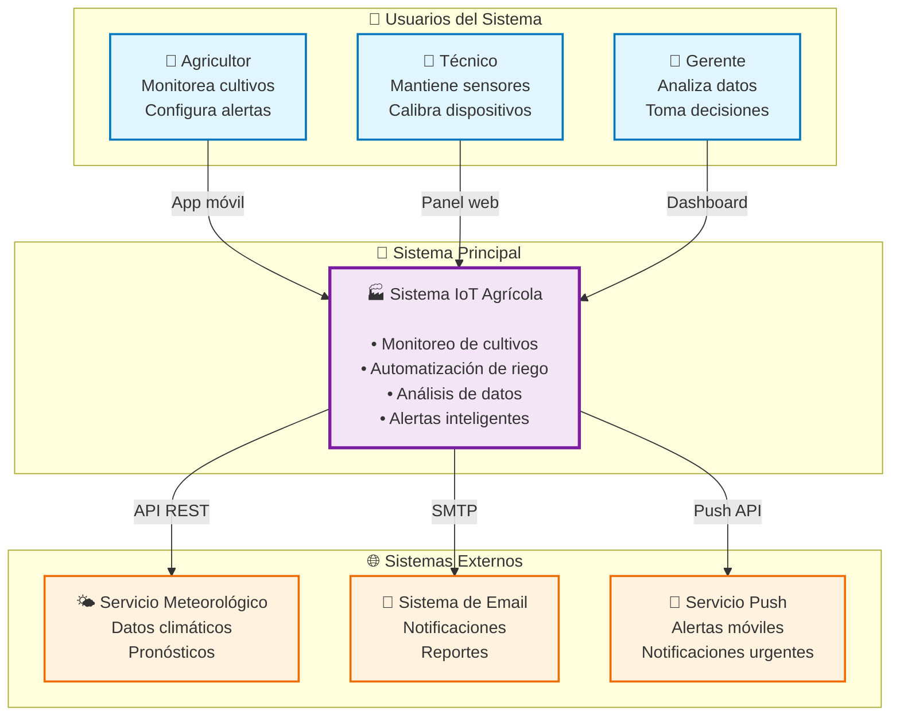
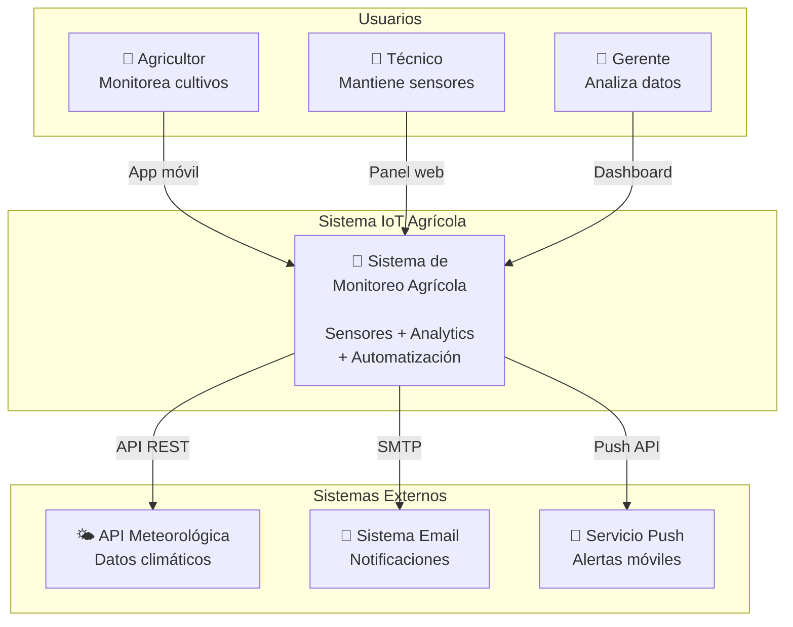
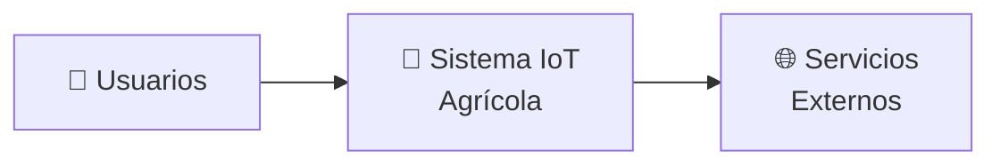
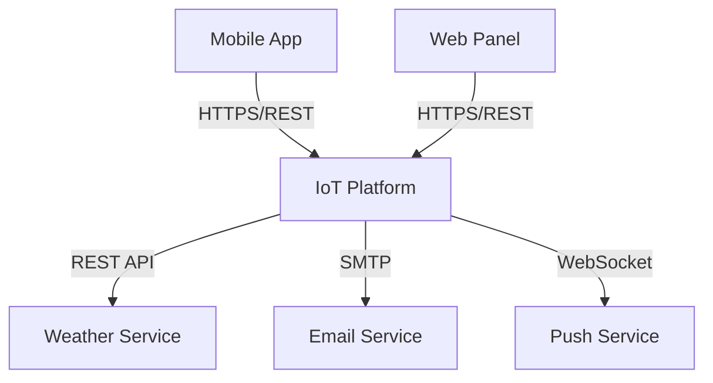

# IoT Context Diagram (Nivel 1)
# Diagrama de Contexto IoT (Nivel 1)

El diagrama de contexto IoT muestra el ecosistema completo del sistema, incluyendo dispositivos físicos, usuarios finales, sistemas de gestión y servicios externos.

## Propósito para IoT
## Purpose for IoT

- **Ecosistema completo**: Sistema IoT en su entorno operacional
- **Stakeholders IoT**: Operadores, usuarios finales, técnicos de mantenimiento
- **Sistemas externos**: Servicios cloud, APIs de terceros, sistemas legacy
- **Entorno físico**: Ubicaciones geográficas, condiciones ambientales
- **Flujos de información**: Datos de sensores, comandos de control, alertas

## Audiencia y Enfoque IoT

- **Audiencia**: Product managers, arquitectos IoT, stakeholders de negocio
- **Nivel de detalle**: Ecosistema completo sin detalles de protocolos
- **Pregunta clave**: "¿Cómo interactúa nuestro sistema IoT con usuarios y entorno?"
- **Consideraciones IoT**: Ubicación física, conectividad, usuarios móviles

## Elementos del Diagrama

### 🎯 **Sistema Principal**
- Una caja central que representa tu sistema IoT
- Nombre claro y descriptivo
- Color distintivo (generalmente azul)

### 👥 **Actores/Usuarios**
- Personas que interactúan con el sistema
- Sistemas externos que se comunican
- Representados como figuras humanas o cajas

### ↔️ **Relaciones**
- Flechas que muestran el flujo de información
- Etiquetas descriptivas de lo que se intercambia
- Protocolo o tecnología (opcional en este nivel)

## Diagrama con Mermaid



### Visualización en GitHub

El diagrama de contexto se visualiza automáticamente en GitHub usando Mermaid:



### Características del diagrama Mermaid

#### ✅ **Ventajas para sistemas IoT:**
- **Renderizado automático en GitHub**: Sin configuración adicional
- **Agrupación clara**: Usuarios, sistema principal y servicios externos
- **Iconos descriptivos**: Mejoran la comprensión visual
- **Estilos diferenciados**: Colores que distinguen tipos de elementos
- **Información contextual**: Descripción de responsabilidades

#### 📝 **Variantes para diferentes audiencias:**

**Para ejecutivos (simplificado):**


**Para desarrolladores (con protocolos):**


## Ejemplo Visual (Texto)

```
┌─────────────────────────────────────────────────────────────┐
│                    DIAGRAMA DE CONTEXTO                    │
├─────────────────────────────────────────────────────────────┤
│                                                             │
│  👤 Agricultor          👤 Técnico          👤 Gerente      │
│      │                     │                     │          │
│      │ App móvil          │ Panel web           │ Dashboard │
│      │                     │                     │          │
│      ▼                     ▼                     ▼          │
│  ┌─────────────────────────────────────────────────────┐   │
│  │                                                     │   │
│  │        Sistema IoT de Monitoreo Agrícola          │   │
│  │     (Monitorea cultivos y automatiza riego)       │   │
│  │                                                     │   │
│  └─────────────────────────────────────────────────────┘   │
│      │                     │                     │          │
│      │ API REST           │ SMTP                │ Push API │
│      ▼                     ▼                     ▼          │
│  📡 Servicio         📧 Sistema           📱 Servicio      │
│  Meteorológico        de Email             Push            │
│                                                             │
└─────────────────────────────────────────────────────────────┘
```

## Checklist para Crear el Diagrama

### ✅ **Antes de empezar:**
- [ ] Identificar el propósito principal del sistema
- [ ] Listar todos los usuarios directos
- [ ] Identificar sistemas externos que interactúan
- [ ] Definir los flujos de información principales

### ✅ **Durante la creación:**
- [ ] Colocar el sistema principal en el centro
- [ ] Usar colores consistentes
- [ ] Etiquetar todas las relaciones claramente
- [ ] Mantener un nivel de abstracción alto
- [ ] Evitar detalles técnicos

### ✅ **Revisión final:**
- [ ] ¿Es comprensible para un no-técnico?
- [ ] ¿Están representados todos los usuarios clave?
- [ ] ¿Las relaciones son claras?
- [ ] ¿El título es descriptivo?

## Ejemplos de Sistemas IoT

### 🏠 **Smart Home**
- **Usuarios**: Familia, invitados, técnico
- **Sistema**: Plataforma domótica
- **Sistemas externos**: Proveedores de energía, servicios de emergencia

### 🏭 **Industria 4.0**
- **Usuarios**: Operadores, supervisores, mantenimiento
- **Sistema**: Plataforma de monitoreo industrial
- **Sistemas externos**: ERP, sistemas de calidad, proveedores

### 🚗 **Fleet Management**
- **Usuarios**: Conductores, despachadores, clientes
- **Sistema**: Sistema de gestión de flota
- **Sistemas externos**: GPS, talleres, seguros

## Errores Comunes

### ❌ **Evitar:**
- Incluir detalles de implementación (bases de datos, APIs específicas)
- Mostrar componentes internos del sistema
- Usar terminología muy técnica
- Crear diagramas demasiado complejos

### ✅ **Mejor práctica:**
- Enfocarse en el valor de negocio
- Usar lenguaje que todos entiendan
- Mantener simplicidad visual
- Validar con stakeholders no técnicos

## Siguientes Pasos

Una vez completado el diagrama de contexto:

1. **Validar** con stakeholders y usuarios
2. **Continuar** con el [Diagrama de Contenedores](./02-Container-Diagram.md)
3. **Documentar** decisiones arquitectónicas importantes
4. **Actualizar** cuando cambien los requisitos

---

**💡 Tip**: El diagrama de contexto debe poder explicarse en 2-3 minutos y ser comprensible para cualquier persona involucrada en el proyecto.