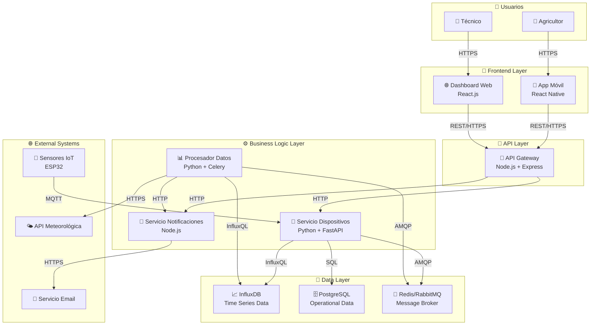

# IoT Container Diagram (Nivel 2)
# Diagrama de Contenedores IoT (Nivel 2)

El diagrama de contenedores IoT muestra la arquitectura técnica del ecosist### 🔌 **Dispositivos IoT (Edge Layer)**
- **Microcontroladores**: ESP32, Arduino, STM32 (C/C++)
- **Single Board Computers**: Raspberry Pi, BeagleBone (Python, Node.js)
- **Edge Computing**: NVIDIA Jetson, Intel NUC (Python, Docker)
- **Industrial PLCs**: Siemens, Allen-Bradley (Ladder Logic)

### 🌐 **Gateways y Conectividad**
- **Protocol Gateways**: Node-RED, Eclipse Kura
- **Edge Gateways**: AWS IoT Greengrass, Azure IoT Edge
- **Message Brokers**: Eclipse Mosquitto (MQTT), Apache Kafka
- **Network Infrastructure**: LoRaWAN servers, Cellular modules

### ☁️ **Servicios Cloud IoT**
- **IoT Platforms**: AWS IoT Core, Azure IoT Hub, Google Cloud IoT
- **Time-series Storage**: InfluxDB, Amazon TimeStream, Azure Data Explorer
- **Stream Processing**: Apache Kafka, AWS Kinesis, Azure Stream Analytics
- **Analytics**: Apache Spark, AWS Lambda, Azure Functions

### 📱 **Interfaces de Usuario IoT**
- **Mobile Apps**: React Native, Flutter (con MQTT/WebSocket)
- **Web Dashboards**: React + D3.js, Grafana, Node-RED Dashboard
- **Notification Services**: Firebase, AWS SNS, Twilio dispositivos, gateways, servicios cloud y aplicaciones de usuario.

## Propósito para IoT
## Purpose for IoT

- **Arquitectura distribuida**: Dispositivos, edge computing, cloud, aplicaciones
- **Tecnologías IoT**: Protocolos (MQTT, LoRa), plataformas (AWS IoT), firmware
- **Conectividad**: Redes inalámbricas, gateways, APIs
- **Procesamiento**: Edge computing vs cloud computing
- **Restricciones**: Energía, ancho de banda, latencia

## Audiencia y Enfoque IoT

- **Audiencia**: Arquitectos IoT, ingenieros de firmware, desarrolladores backend
- **Nivel de detalle**: Arquitectura técnica con protocolos específicos
- **Pregunta clave**: "¿Cómo están distribuidos los componentes desde dispositivos hasta la nube?"

## ¿Qué es un Contenedor IoT?

Un contenedor IoT representa una **unidad ejecutable** en el ecosistema:
- **Dispositivos**: Sensores, actuadores, gateways
- **Servicios cloud**: Plataformas IoT, APIs, procesamiento
- **Aplicaciones**: Móviles, web, dashboards
- **Almacenamiento**: Bases de datos time-series, operational data
- **Comunicación**: Message brokers, API gateways

## Elementos del Diagrama

### 📦 **Contenedores**
- Aplicaciones, servicios, bases de datos
- Tecnología específica (Node.js, PostgreSQL, etc.)
- Responsabilidades claras

### 👥 **Personas/Sistemas Externos**
- Mismos actores del diagrama de contexto
- Sistemas externos que interactúan

### ↔️ **Relaciones**
- Protocolos de comunicación específicos
- Puertos y tecnologías
- Flujo de datos

## Plantilla PlantUML

```plantuml
@startuml Container_Diagram
!include https://raw.githubusercontent.com/plantuml-stdlib/C4-PlantUML/master/C4_Container.puml

title Sistema IoT de Monitoreo Agrícola - Diagrama de Contenedores

Person(farmer, "Agricultor", "Usuario que monitorea cultivos")
Person(technician, "Técnico", "Mantiene sensores")

System_Boundary(iot_system, "Sistema IoT Agrícola") {
    Container(mobile_app, "App Móvil", "React Native", "Permite monitoreo en tiempo real y configuración de alertas")
    Container(web_app, "Dashboard Web", "React.js", "Panel de control para técnicos y análisis avanzado")
    Container(api_gateway, "API Gateway", "Node.js + Express", "Punto de entrada unificado para todas las APIs")
    Container(device_service, "Servicio de Dispositivos", "Python + FastAPI", "Gestiona comunicación con sensores IoT")
    Container(data_processor, "Procesador de Datos", "Python + Celery", "Procesa y analiza datos de sensores")
    Container(notification_service, "Servicio de Notificaciones", "Node.js", "Envía alertas y notificaciones")
    ContainerDb(time_series_db, "Base de Datos de Series Temporales", "InfluxDB", "Almacena datos históricos de sensores")
    ContainerDb(operational_db, "Base de Datos Operacional", "PostgreSQL", "Configuración, usuarios, dispositivos")
    Container(message_broker, "Message Broker", "Redis/RabbitMQ", "Cola de mensajes para procesamiento asíncrono")
}

System_Ext(iot_devices, "Sensores IoT", "ESP32 con sensores ambientales")
System_Ext(weather_api, "API Meteorológica", "Servicio externo de clima")
System_Ext(email_service, "Servicio Email", "SendGrid/AWS SES")

' Relaciones con usuarios
Rel(farmer, mobile_app, "Usa", "HTTPS")
Rel(technician, web_app, "Administra", "HTTPS")

' Relaciones entre contenedores
Rel(mobile_app, api_gateway, "Hace llamadas API", "HTTPS/REST")
Rel(web_app, api_gateway, "Hace llamadas API", "HTTPS/REST")
Rel(api_gateway, device_service, "Rutea requests", "HTTP/REST")
Rel(api_gateway, notification_service, "Rutea requests", "HTTP/REST")

Rel(device_service, operational_db, "Lee/Escribe", "SQL")
Rel(device_service, time_series_db, "Escribe datos", "HTTP/InfluxQL")
Rel(device_service, message_broker, "Publica eventos", "Redis/AMQP")

Rel(data_processor, message_broker, "Consume eventos", "Redis/AMQP")
Rel(data_processor, time_series_db, "Lee/Escribe", "HTTP/InfluxQL")
Rel(data_processor, notification_service, "Triggers alertas", "HTTP/REST")

Rel(notification_service, email_service, "Envía emails", "HTTPS/API")

' Relaciones con sistemas externos
Rel(iot_devices, device_service, "Envía datos", "MQTT/HTTP")
Rel(data_processor, weather_api, "Obtiene datos", "HTTPS/REST")

@enduml
```

## Ejemplo Visual (Texto)

```
┌─────────────────────────────────────────────────────────────────────────────────┐
│                          DIAGRAMA DE CONTENEDORES                              │
├─────────────────────────────────────────────────────────────────────────────────┤
│                                                                                 │
│ 👤 Agricultor                    👤 Técnico                                    │
│     │                               │                                           │
│     │ HTTPS                        │ HTTPS                                    │
│     ▼                               ▼                                           │
│ ┌─────────────┐                 ┌─────────────┐                               │
│ │  App Móvil  │                 │ Dashboard   │                               │
│ │ React Native│                 │ React.js    │                               │
│ └─────────────┘                 └─────────────┘                               │
│     │                               │                                           │
│     │ HTTPS/REST                   │ HTTPS/REST                               │
│     ▼                               ▼                                           │
│ ┌─────────────────────────────────────────────────────────────┐               │
│ │                  API Gateway                                │               │
│ │                Node.js + Express                            │               │
│ └─────────────────────────────────────────────────────────────┘               │
│     │                               │                                           │
│     │ HTTP/REST                    │ HTTP/REST                                │
│     ▼                               ▼                                           │
│ ┌─────────────┐  Redis/AMQP   ┌─────────────┐      HTTP/REST  ┌─────────────┐ │
│ │ Servicio de │◄─────────────►│ Procesador  │◄───────────────►│ Servicio de │ │
│ │ Dispositivos│               │ de Datos    │                 │Notificaciones│ │
│ │Python+FastAPI│              │Python+Celery│                 │   Node.js   │ │
│ └─────────────┘               └─────────────┘                 └─────────────┘ │
│     │                               │                               │           │
│     │ SQL                          │ InfluxQL                      │ HTTPS/API │
│     ▼                               ▼                               ▼           │
│ ┌─────────────┐               ┌─────────────┐                 📧 Email        │
│ │PostgreSQL   │               │  InfluxDB   │                   Service       │
│ │(Operacional)│               │(Temporal)   │                                 │
│ └─────────────┘               └─────────────┘                                 │
│                                                                                 │
│ 📡 Sensores IoT ──MQTT/HTTP──► Servicio de Dispositivos                       │
│                                                                                 │
└─────────────────────────────────────────────────────────────────────────────────┘
```

## Tipos de Contenedores en IoT

### 🖥️ **Aplicaciones Web**
- **Dashboard administrativo**: React, Angular, Vue
- **Panel de monitoreo**: Grafana, custom dashboards
- **Portal de configuración**: Django, Rails

### 📱 **Aplicaciones Móviles**
- **Apps nativas**: Swift (iOS), Kotlin (Android)
- **Apps híbridas**: React Native, Flutter, Ionic
- **PWAs**: Progressive Web Apps

### 🔧 **APIs y Microservicios**
- **API Gateway**: Kong, AWS API Gateway, Nginx
- **Servicios de dominio**: Node.js, Python, Java, Go
- **Procesamiento de datos**: Apache Kafka, Apache Storm

### 💾 **Almacenamiento**
- **Bases de datos relacionales**: PostgreSQL, MySQL
- **Bases de datos de series temporales**: InfluxDB, TimescaleDB
- **Bases de datos NoSQL**: MongoDB, Cassandra
- **Cache**: Redis, Memcached

### 🔄 **Mensajería**
- **Message brokers**: RabbitMQ, Apache Kafka
- **Colas**: Redis, AWS SQS
- **Pub/Sub**: MQTT broker (Mosquitto, HiveMQ)

## Checklist para Diagramas IoT

### ✅ **Identificación de dispositivos y edge:**
- [ ] ¿Qué tipos de sensores/actuadores necesitamos?
- [ ] ¿Necesitamos gateways o edge computing?
- [ ] ¿Qué protocolos de comunicación (MQTT, LoRa, WiFi)?
- [ ] ¿Hay procesamiento local en dispositivos?

### ✅ **Arquitectura cloud y servicios:**
- [ ] ¿Qué plataforma IoT cloud (AWS IoT, Azure IoT)?
- [ ] ¿Necesitamos time-series database?
- [ ] ¿Qué servicios de analytics en tiempo real?
- [ ] ¿Cómo manejamos escalabilidad de dispositivos?

### ✅ **Interfaces y usuarios:**
- [ ] ¿Apps móviles para usuarios finales?
- [ ] ¿Dashboards web para operadores?
- [ ] ¿Sistemas de alertas y notificaciones?
- [ ] ¿Integración con sistemas empresariales?

### ✅ **Conectividad y protocolos:**
- [ ] MQTT brokers y topics structure
- [ ] APIs REST para configuración
- [ ] WebSockets para real-time updates
- [ ] Protocolos de red específicos (LoRaWAN, Sigfox)

## Patrones Comunes en IoT

### 🏗️ **Arquitectura por Capas**
```
Frontend (App/Web) → API Gateway → Servicios → Base de Datos
```

### 🔄 **Event-Driven Architecture**
```
Dispositivos → Message Broker → Procesadores → Notificaciones
```

### 🌐 **Microservicios**
```
- Servicio de Dispositivos
- Servicio de Usuarios  
- Servicio de Datos
- Servicio de Notificaciones
```

## Consideraciones Especiales para IoT

### 📡 **Conectividad de Dispositivos**
- MQTT brokers para comunicación eficiente
- Protocolos específicos (LoRaWAN, Sigfox)
- Gateways para agregación de datos

### ⚡ **Procesamiento en Tiempo Real**
- Stream processing (Apache Kafka, Apache Storm)
- Edge computing containers
- Time-series databases optimizadas

### 🔒 **Seguridad**
- Certificate management services
- API authentication/authorization
- Device identity management

## Errores Comunes

### ❌ **Evitar:**
- Incluir componentes internos de un contenedor
- Mostrar múltiples instancias del mismo contenedor
- Omitir tecnologías específicas
- No especificar protocolos de comunicación

### ✅ **Mejor práctica:**
- Un contenedor = una aplicación ejecutable
- Incluir tecnología específica en cada contenedor
- Mostrar dependencias claras
- Documentar decisiones arquitectónicas

## Siguientes Pasos

1. **Validar** la arquitectura con el equipo técnico
2. **Continuar** con [Diagrama de Componentes](./03-Component-Diagram.md) para contenedores complejos
3. **Planificar** la infraestructura y despliegue
4. **Documentar** APIs y interfaces entre contenedores

### Visualización en GitHub

Para visualizar este diagrama en GitHub, tienes varias opciones:

#### Opción 1: Servidor PlantUML público
Copia el código PlantUML y pégalo en: http://www.plantuml.com/plantuml/uml/

#### Opción 2: Extensión VS Code
Instala la extensión "PlantUML" en VS Code para preview en tiempo real.

#### Opción 3: Mermaid (alternativa que funciona en GitHub)
GitHub soporta Mermaid nativamente. Versión del diagrama de contenedores:



**💡 Ventaja de Mermaid**: Se renderiza automáticamente en GitHub y permite mostrar la arquitectura distribuida típica de sistemas IoT.

---

**💡 Tip**: Este diagrama debe ser la base para definir el stack tecnológico y planificar el desarrollo de cada contenedor por separado.