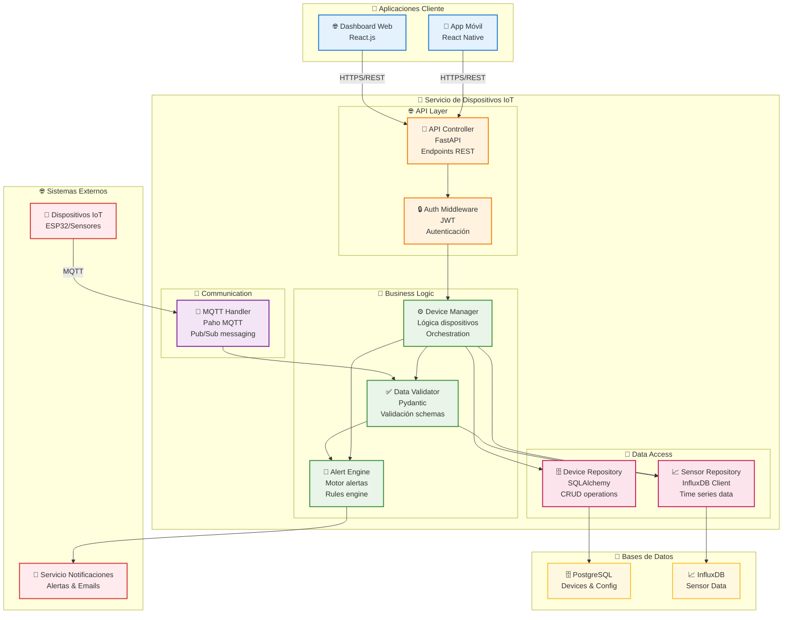
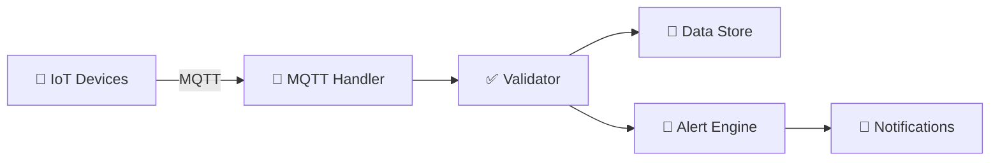
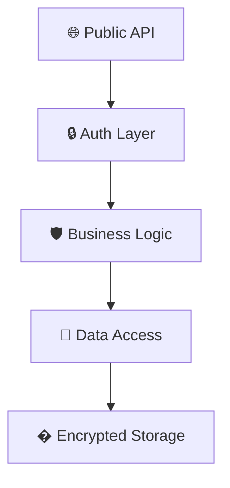

# Component Diagram (Nivel 3)
# Diagrama de Componentes

# IoT Component Diagram (Nivel 3)
# Diagrama de Componentes IoT (Nivel 3)

El diagrama de componentes IoT muestra la arquitectura interna de dispositivos, gateways o servicios cloud, detallando módulos de firmware, drivers y servicios especializados.

## Propósito para IoT
## Purpose for IoT

- **Arquitectura de firmware**: Módulos dentro de dispositivos IoT
- **Drivers y HAL**: Hardware Abstraction Layer y drivers específicos
- **Servicios especializados**: Componentes de comunicación, seguridad, procesamiento
- **Patrones IoT**: Organización típica de sistemas embebidos y edge computing

## Audiencia y Enfoque IoT

- **Audiencia**: Ingenieros de firmware, desarrolladores IoT, arquitectos embedded
- **Nivel de detalle**: Arquitectura interna de dispositivos y servicios IoT
- **Pregunta clave**: "¿Cómo están organizados los módulos internos de este dispositivo/servicio?"

## ¿Qué es un Componente IoT?

Un componente IoT es una **unidad funcional especializada**:
- **En dispositivos**: Drivers, HAL, protocolos de comunicación, sensores managers
- **En servicios**: Handlers de protocolos, parsers de datos, algoritmos de procesamiento
- **En gateways**: Protocol translators, data aggregators, security modules
- **En cloud**: Device managers, data processors, alert engines

## Cuándo Crear Diagramas de Componentes IoT

### ✅ **Crear cuando:**
- Firmware complejo con múltiples protocolos de comunicación
- Dispositivos con procesamiento edge y múltiples sensores
- Gateways que manejan diversos protocolos (MQTT, LoRa, Modbus)
- Servicios cloud con lógica compleja de procesamiento IoT
- Sistemas con algoritmos críticos de procesamiento de señales

### ❌ **No crear cuando:**
- Sensores simples con un solo propósito
- Firmware estándar sin customización
- Servicios con lógica trivial de paso de datos

## Diagrama con Mermaid



## Ejemplo Visual (Texto)

```
┌─────────────────────────────────────────────────────────────────────────────────┐
│                    SERVICIO DE DISPOSITIVOS - COMPONENTES                      │
├─────────────────────────────────────────────────────────────────────────────────┤
│                                                                                 │
│ 📱 App Móvil ────┐                    ┌──── 🖥️ Dashboard Web                   │
│                  │ HTTPS/REST         │ HTTPS/REST                             │
│                  ▼                    ▼                                        │
│ ┌─────────────────────────────────────────────────────────────────────────────┐ │
│ │                        SERVICIO DE DISPOSITIVOS                           │ │
│ │ ┌─────────────────┐    ┌──────────────┐    ┌──────────────────────────┐  │ │
│ │ │  API Controller │◄──►│Auth Middleware│    │      MQTT Handler        │  │ │
│ │ │    FastAPI      │    │     JWT       │    │      Paho MQTT          │  │ │
│ │ └─────────────────┘    └──────────────┘    └──────────────────────────┘  │ │
│ │          │                                           │                     │ │
│ │          ▼                                           ▼                     │ │
│ │ ┌─────────────────┐    ┌──────────────┐    ┌──────────────────────────┐  │ │
│ │ │ Device Manager  │◄──►│Data Validator│    │     Alert Engine        │  │ │
│ │ │ Python Class    │    │  Pydantic    │    │    Python Class        │  │ │
│ │ └─────────────────┘    └──────────────┘    └──────────────────────────┘  │ │
│ │          │                                           │                     │ │
│ │          ▼                                           ▼                     │ │
│ │ ┌─────────────────┐    ┌──────────────────────────────────────────────┐  │ │
│ │ │Device Repository│    │         Sensor Repository                    │  │ │
│ │ │  SQLAlchemy     │    │        InfluxDB Client                      │  │ │
│ │ └─────────────────┘    └──────────────────────────────────────────────┘  │ │
│ └─────────────────────────────────────────────────────────────────────────────┘ │
│          │                                           │                           │
│          ▼ SQL                                       ▼ InfluxQL                 │
│    ┌─────────────┐                              ┌─────────────┐                 │
│    │ PostgreSQL  │                              │  InfluxDB   │                 │
│    └─────────────┘                              └─────────────┘                 │
│                                                                                 │
│ 📡 Dispositivos IoT ──MQTT──► MQTT Handler                                     │
│                                                                                 │
│ Alert Engine ──HTTP/REST──► 🔔 Servicio Notificaciones                        │
│                                                                                 │
└─────────────────────────────────────────────────────────────────────────────────┘
```

## Patrones Arquitectónicos Comunes

### 🏗️ **Layered Architecture (Capas)**
```
┌─────────────────┐
│ Presentation    │ ← Controllers, REST endpoints
├─────────────────┤
│ Business Logic  │ ← Services, Domain logic
├─────────────────┤
│ Data Access     │ ← Repositories, DAOs
├─────────────────┤
│ Database        │ ← PostgreSQL, MongoDB
└─────────────────┘
```

### 🔄 **Event-Driven Components**
```
Event Producer → Event Bus → Event Handlers → Side Effects
```

### 🎯 **Clean Architecture**
```
┌─────────────────┐
│ Controllers     │ ← API, UI
├─────────────────┤
│ Use Cases       │ ← Business logic
├─────────────────┤
│ Entities        │ ← Domain models
├─────────────────┤
│ Infrastructure  │ ← DB, External APIs
└─────────────────┘
```

## Componentes Típicos en Sistemas IoT

### 🎮 **Presentation Layer**
- **API Controllers**: Endpoints REST/GraphQL
- **WebSocket Handlers**: Comunicación en tiempo real
- **Auth Middleware**: Autenticación/autorización

### 🧠 **Business Logic Layer**
- **Device Manager**: Gestión de dispositivos
- **Data Processor**: Procesamiento de datos de sensores
- **Alert Engine**: Motor de alertas y reglas
- **Rule Engine**: Reglas de negocio complejas

### 📊 **Data Layer**
- **Device Repository**: CRUD de dispositivos
- **Sensor Data Repository**: Datos de series temporales
- **Configuration Repository**: Configuración del sistema
- **Cache Manager**: Gestión de caché

### 🔌 **Integration Layer**
- **MQTT Handler**: Comunicación con dispositivos
- **HTTP Client**: APIs externas
- **Message Queue Producer**: Publicación de eventos

## Ejemplo Detallado: API Controller

```python
# Ejemplo de definición de componente
from fastapi import APIRouter, Depends, HTTPException
from .device_manager import DeviceManager
from .auth_middleware import get_current_user

class DeviceController:
    """
    Componente: API Controller
    Responsabilidad: Exponer endpoints REST para gestión de dispositivos
    Dependencias: DeviceManager, AuthMiddleware
    """
    
    def __init__(self):
        self.router = APIRouter()
        self.device_manager = DeviceManager()
        self._setup_routes()
    
    def _setup_routes(self):
        @self.router.get("/devices")
        async def get_devices(user = Depends(get_current_user)):
            return await self.device_manager.get_user_devices(user.id)
        
        @self.router.post("/devices/{device_id}/data")
        async def receive_data(device_id: str, data: dict):
            return await self.device_manager.process_sensor_data(device_id, data)
```

## Checklist para Crear el Diagrama

### ✅ **Identificación de componentes:**
- [ ] ¿Cuáles son las responsabilidades principales?
- [ ] ¿Qué patrones arquitectónicos usamos?
- [ ] ¿Qué librerías/frameworks principales?
- [ ] ¿Hay componentes transversales? (logging, auth, validation)

### ✅ **Relaciones entre componentes:**
- [ ] ¿Cómo se comunican los componentes?
- [ ] ¿Hay dependencias cíclicas? (evitar)
- [ ] ¿Las responsabilidades están bien separadas?
- [ ] ¿Siguen principios SOLID?

### ✅ **Interfaces externas:**
- [ ] ¿Qué APIs expone el contenedor?
- [ ] ¿Qué sistemas externos consume?
- [ ] ¿Cómo maneja la autenticación?

## Casos de Uso Específicos para IoT

### 📡 **Gateway IoT**
- **Protocol Handlers**: MQTT, CoAP, LoRaWAN
- **Data Aggregator**: Agregación de datos
- **Edge Processor**: Procesamiento local
- **Cloud Connector**: Sincronización con cloud

### 🏭 **Plataforma Industrial**
- **Device Twin Manager**: Digital twins
- **Predictive Engine**: Mantenimiento predictivo
- **Safety Monitor**: Monitoreo de seguridad
- **Production Optimizer**: Optimización de procesos

### 🏠 **Sistema Domótico**
- **Scene Manager**: Gestión de escenas
- **Automation Engine**: Automatizaciones
- **Voice Interface**: Integración con Alexa/Google
- **Mobile Sync**: Sincronización móvil

## Errores Comunes

### ❌ **Evitar:**
- Componentes con múltiples responsabilidades
- Dependencias circulares entre componentes
- Exposición de detalles de implementación
- Componentes demasiado granulares

### ✅ **Mejor práctica:**
- Un componente = una responsabilidad
- Interfaces claras entre componentes
- Inyección de dependencias
- Testabilidad de cada componente

## Herramientas de Validación

### 🔍 **Análisis de Código**
- **SonarQube**: Calidad y complejidad
- **Architecture Tests**: Validar dependencias
- **Dependency Graphs**: Visualizar dependencias reales

### 📊 **Métricas**
- **Cyclomatic Complexity**: Complejidad por componente
- **Coupling/Cohesion**: Acoplamiento entre componentes
- **Test Coverage**: Cobertura por componente

## Siguientes Pasos

1. **Implementar** componentes siguiendo el diseño
2. **Crear tests** unitarios para cada componente
3. **Validar** que las dependencias reales coincidan con el diagrama
4. **Continuar** con [Diagrama de Código](./04-Code-Diagram.md) si es necesario

### Características del diagrama Mermaid para IoT

#### ✅ **Separación clara de responsabilidades:**
- **API Layer**: Entrada de requests y autenticación
- **Business Logic**: Orchestración, validación y alertas
- **Communication**: Manejo específico de protocolos IoT (MQTT)
- **Data Access**: Persistencia especializada (SQL + Time Series)

#### 🎨 **Ventajas visuales:**
- **Agrupación por capas** facilita comprensión arquitectónica
- **Colores diferenciados** por tipo de responsabilidad
- **Flujos claramente marcados** entre componentes
- **Iconos descriptivos** para mejor identificación

#### 📊 **Variantes del diagrama:**

**Vista de flujo de datos simplificada:**


**Vista de capas de seguridad:**


---

**💡 Tip**: Este diagrama debe servir como blueprint para la implementación. Si el código real difiere mucho del diagrama, uno de los dos necesita actualizarse.