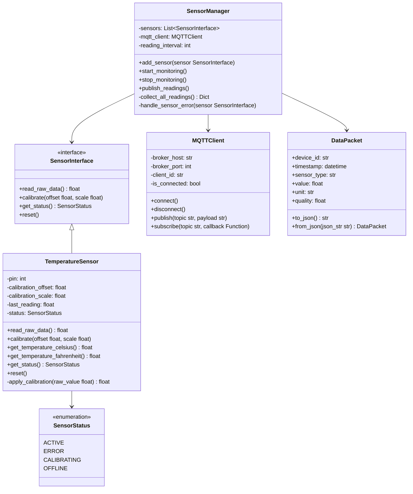
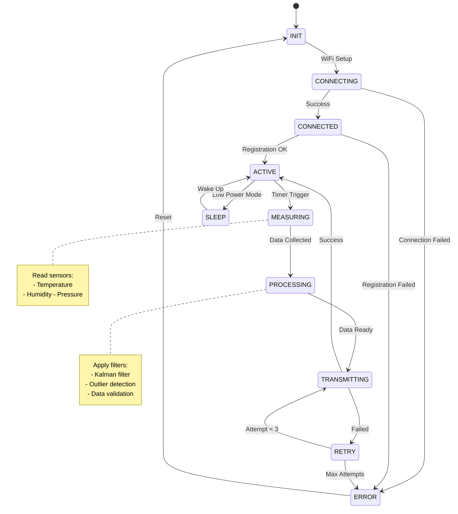

# Code Diagram (Nivel 4)
# Diagrama de Código

# IoT Code Diagram (Nivel 4)
# Diagrama de Código IoT (Nivel 4)

El diagrama de código IoT muestra implementaciones específicas de algoritmos críticos, drivers de hardware, protocolos de comunicación y lógica de procesamiento de señales.

## Propósito para IoT
## Purpose for IoT

- **Algoritmos críticos**: Implementación de filtros digitales, calibración, control
- **Drivers de hardware**: Interfaces específicas con sensores y actuadores
- **Protocolos IoT**: Implementación de MQTT, CoAP, LoRaWAN
- **Optimización**: Código crítico para performance y consumo energético

## Audiencia y Enfoque IoT

- **Audiencia**: Ingenieros de firmware, desarrolladores embedded, especialistas en algoritmos
- **Nivel de detalle**: Implementación específica de código crítico
- **Pregunta clave**: "¿Cómo implementamos exactamente este algoritmo/driver IoT?"

## ¿Cuándo Crear Diagramas de Código IoT?

### ✅ **Crear cuando:**
- Algoritmos de procesamiento de señales (filtros, FFT, calibración)
- Drivers complejos para sensores específicos
- Implementación de protocolos IoT customizados
- State machines para control de dispositivos
- Algoritmos de control (PID, fuzzy logic)
- Código crítico para optimización energética

### ❌ **No crear cuando:**
- Uso estándar de librerías (Arduino, ESP-IDF básico)
- Código simple de lectura de sensores
- Implementaciones triviales de MQTT
- Código que se regenera automáticamente

## Tipos de Diagramas de Código IoT

### 📊 **Class Diagram para Firmware**
- Clases de drivers, sensores, actuadores
- Herencia para familias de sensores
- Interfaces HAL (Hardware Abstraction Layer)

### 🔄 **Sequence Diagram para Protocolos**
- Flujo de handshake en comunicaciones
- Secuencias de inicialización de dispositivos
- Protocolos de descubrimiento y configuración

### 🏗️ **State Machine Diagrams**
- Estados de dispositivos IoT (sleep, active, error)
- Máquinas de estado para protocolos
- Control de actuadores complejos

### ⚡ **Algorithm Flow Diagrams**
- Algoritmos de procesamiento de señales
- Lógica de control y automatización
- Algoritmos de calibración y compensación

## Diagrama de Clases con Mermaid

## Diagrama de Secuencia con Mermaid

## Ejemplo en Python

```python
from abc import ABC, abstractmethod
from datetime import datetime
from typing import List, Optional
from dataclasses import dataclass
from enum import Enum

class DeviceStatus(Enum):
    ONLINE = "online"
    OFFLINE = "offline"
    ERROR = "error"
    MAINTENANCE = "maintenance"

@dataclass
class SensorData:
    """Representa datos de un sensor IoT"""
    device_id: str
    timestamp: datetime
    temperature: Optional[float] = None
    humidity: Optional[float] = None
    battery_level: Optional[float] = None
    
    def validate(self) -> bool:
        """Valida que los datos estén en rangos aceptables"""
        if self.temperature and not (-50 <= self.temperature <= 100):
            return False
        if self.humidity and not (0 <= self.humidity <= 100):
            return False
        if self.battery_level and not (0 <= self.battery_level <= 100):
            return False
        return True

class IDeviceRepository(ABC):
    """Interface para acceso a datos de dispositivos"""
    
    @abstractmethod
    async def find_by_id(self, device_id: str) -> Optional['Device']:
        pass
    
    @abstractmethod
    async def find_by_user(self, user_id: str) -> List['Device']:
        pass
    
    @abstractmethod
    async def save(self, device: 'Device') -> 'Device':
        pass

class Device:
    """Representa un dispositivo IoT"""
    
    def __init__(self, id: str, name: str, user_id: str):
        self.id = id
        self.name = name
        self.user_id = user_id
        self.status = DeviceStatus.OFFLINE
        self.created_at = datetime.now()
        self.last_seen: Optional[datetime] = None
    
    def is_online(self) -> bool:
        """Verifica si el dispositivo está online"""
        if not self.last_seen:
            return False
        
        time_diff = datetime.now() - self.last_seen
        return time_diff.total_seconds() < 300  # 5 minutos
    
    def update_last_seen(self) -> None:
        """Actualiza timestamp de última comunicación"""
        self.last_seen = datetime.now()
        self.status = DeviceStatus.ONLINE

class DeviceManager:
    """Gestiona la lógica de negocio para dispositivos IoT"""
    
    def __init__(self, 
                 device_repo: IDeviceRepository,
                 sensor_repo: 'ISensorDataRepository'):
        self.device_repo = device_repo
        self.sensor_repo = sensor_repo
        self.alert_engine = AlertEngine()
    
    async def process_sensor_data(self, device_id: str, data: dict) -> bool:
        """
        Procesa datos recibidos de un sensor
        
        Args:
            device_id: ID del dispositivo
            data: Datos del sensor
            
        Returns:
            bool: True si se procesó correctamente
            
        Raises:
            ValueError: Si los datos no son válidos
            DeviceNotFoundError: Si el dispositivo no existe
        """
        # Validar datos
        sensor_data = SensorData(
            device_id=device_id,
            timestamp=datetime.now(),
            **data
        )
        
        if not sensor_data.validate():
            raise ValueError("Invalid sensor data")
        
        # Verificar que el dispositivo existe
        device = await self.device_repo.find_by_id(device_id)
        if not device:
            raise DeviceNotFoundError(f"Device {device_id} not found")
        
        # Guardar datos
        await self.sensor_repo.save_reading(device_id, sensor_data)
        
        # Actualizar estado del dispositivo
        device.update_last_seen()
        await self.device_repo.save(device)
        
        # Evaluar alertas
        alerts = self.alert_engine.evaluate_data(device_id, sensor_data)
        if alerts:
            await self.alert_engine.process_alerts(alerts)
        
        return True
    
    async def get_user_devices(self, user_id: str) -> List[Device]:
        """Obtiene todos los dispositivos de un usuario"""
        return await self.device_repo.find_by_user(user_id)
```

## Patrones de Diseño Comunes en IoT

### 🏭 **Factory Pattern**
```python
class DeviceFactory:
    @staticmethod
    def create_device(device_type: str, config: dict) -> Device:
        if device_type == "temperature":
            return TemperatureSensor(config)
        elif device_type == "humidity":
            return HumiditySensor(config)
        else:
            raise ValueError(f"Unknown device type: {device_type}")
```

### 👀 **Observer Pattern**
```python
class DeviceEventBus:
    def __init__(self):
        self._observers = []
    
    def subscribe(self, observer):
        self._observers.append(observer)
    
    def notify(self, event):
        for observer in self._observers:
            observer.handle_event(event)
```

### 🎯 **Strategy Pattern**
```python
class DataProcessingStrategy(ABC):
    @abstractmethod
    def process(self, data: SensorData) -> ProcessedData:
        pass

class RealTimeProcessor(DataProcessingStrategy):
    def process(self, data: SensorData) -> ProcessedData:
        # Procesamiento en tiempo real
        return ProcessedData(data)

class BatchProcessor(DataProcessingStrategy):
    def process(self, data: SensorData) -> ProcessedData:
        # Procesamiento por lotes
        return ProcessedData(data)
```

## Documentación de APIs Internas

### 📝 **Method Documentation**
```python
def process_sensor_data(self, device_id: str, data: dict) -> bool:
    """
    Procesa datos recibidos de un sensor IoT
    
    Este método valida los datos, verifica que el dispositivo existe,
    guarda los datos en la base de datos y evalúa posibles alertas.
    
    Args:
        device_id (str): Identificador único del dispositivo
        data (dict): Diccionario con los datos del sensor
                    Debe contener al menos 'timestamp'
                    Campos opcionales: 'temperature', 'humidity', 'battery_level'
    
    Returns:
        bool: True si los datos se procesaron correctamente
    
    Raises:
        ValueError: Si los datos no pasan la validación
        DeviceNotFoundError: Si el device_id no existe
        DatabaseError: Si hay problemas de conectividad
    
    Example:
        >>> manager = DeviceManager(device_repo, sensor_repo)
        >>> data = {'temperature': 25.5, 'humidity': 60.0}
        >>> success = await manager.process_sensor_data('device_001', data)
        >>> print(success)  # True
    """
```

## Checklist para Diagramas de Código

### ✅ **Antes de crear:**
- [ ] ¿Es realmente necesario este nivel de detalle?
- [ ] ¿El componente es lo suficientemente complejo?
- [ ] ¿Ayudará a otros desarrolladores?
- [ ] ¿Hay patrones específicos que documentar?

### ✅ **Durante la creación:**
- [ ] Incluir atributos y métodos importantes
- [ ] Mostrar tipos de datos cuando sea relevante
- [ ] Documentar parámetros y valores de retorno
- [ ] Incluir excepciones importantes

### ✅ **Mantenimiento:**
- [ ] Actualizar cuando el código cambie
- [ ] Validar que coincida con la implementación
- [ ] Revisar durante code reviews
- [ ] Generar automáticamente si es posible

## Herramientas de Generación Automática

### 🐍 **Python**
```bash
# Generar diagramas desde código
pyreverse -o png -p DeviceManager src/device/
```

### 🏗️ **IDE Integrations**
- **VS Code**: Mermaid preview extension
- **PyCharm**: Mermaid plugin
- **IntelliJ**: Mermaid diagrams support

## Casos de Uso Específicos

### 🔄 **Flujo de Procesamiento de Datos**
- Sequence diagram para mostrar el flow completo
- Manejo de errores y rollbacks
- Interacciones asíncronas

### 🏗️ **Patrones de Integración**
- Adapter pattern para protocolos diversos
- Facade pattern para APIs complejas
- Chain of Responsibility para procesamiento

### 📊 **Algoritmos Complejos**
- Algoritmos de machine learning
- Procesamiento de señales
- Detección de anomalías

## Errores Comunes

### ❌ **Evitar:**
- Diagramas que duplican el código exactamente
- Demasiado detalle en métodos triviales
- Diagramas desactualizados
- Documentar implementación en lugar de diseño

### ✅ **Mejor práctica:**
- Enfocarse en la intención del diseño
- Mostrar patrones y relaciones importantes
- Mantener sincronizado con el código
- Usar para onboarding y arquitectura

## Integración con Desarrollo

### 🔄 **CI/CD Integration**
```yaml
# .github/workflows/docs.yml
- name: Generate Code Diagrams
  run: |
    pyreverse -o png -p IoTSystem src/
```

### 📝 **Documentation as Code**
Los diagramas Mermaid se integran directamente en el código fuente y documentación sin herramientas adicionales.

### Visualización Nativa en GitHub

**✅ Ventaja principal**: Mermaid se renderiza automáticamente en GitHub sin configuración adicional.

### Diagrama de Clases IoT con Mermaid



#### Opción 4: State Machine para Control IoT
Para dispositivos IoT con estados complejos:



**💡 Ventaja**: Mermaid permite mostrar tanto diagramas de clases como máquinas de estado, fundamentales en el desarrollo de firmware IoT.

---

**💡 Tip**: Los diagramas de código deben ser una herramienta de comunicación, no una carga de mantenimiento. Úsalos estratégicamente solo donde agreguen valor real.