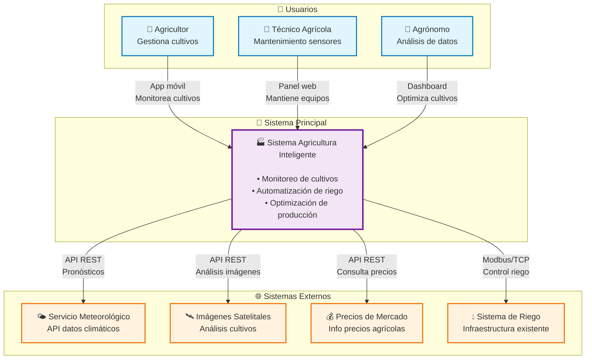
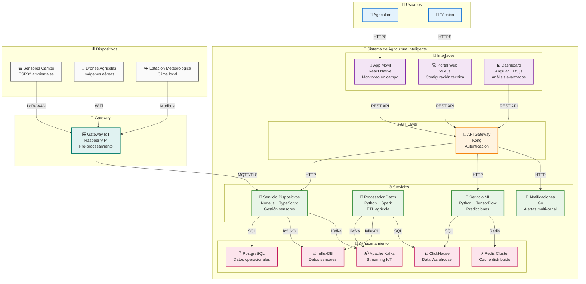
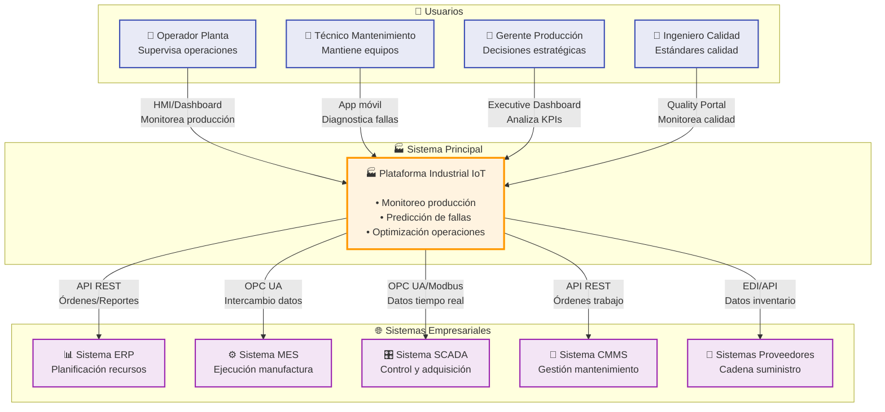
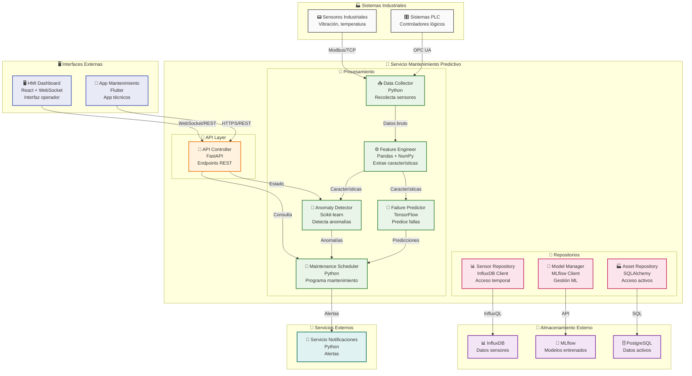
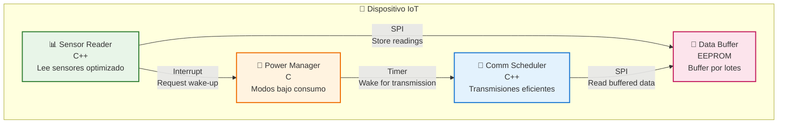
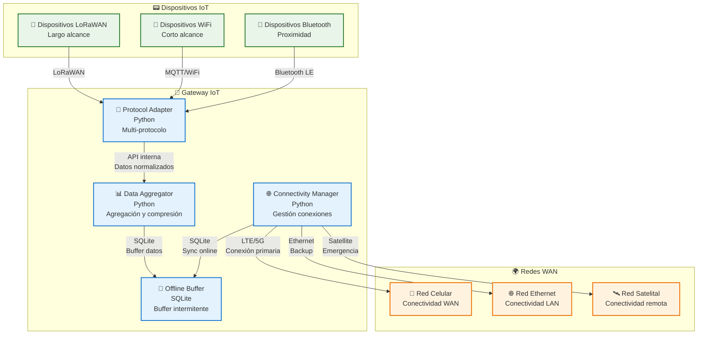
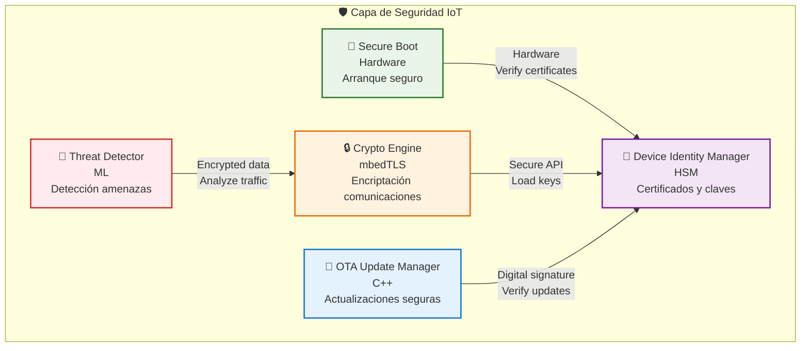

# IoT-Specific C4 Examples
# Ejemplos C4 Específicos para IoT

Esta guía presenta ejemplos completos de diagramas C4 aplicados a diferentes tipos de sistemas IoT, mostrando las particularidades y consideraciones especiales para este dominio.

## Características Especiales de Sistemas IoT

### 🌐 **Conectividad Diversa**
- Múltiples protocolos: MQTT, CoAP, LoRaWAN, Sigfox
- Conectividad intermitente y limitada
- Edge computing y procesamiento distribuido

### ⚡ **Restricciones de Recursos**
- Dispositivos con limitaciones de energía
- Ancho de banda limitado
- Capacidad de procesamiento reducida

### 📊 **Manejo de Datos**
- Grandes volúmenes de datos temporales
- Necesidad de procesamiento en tiempo real
- Almacenamiento distribuido

---

## Ejemplo 1: Smart Agriculture System

### Context Diagram (Mermaid)


### Container Diagram (Mermaid)


---

## Ejemplo 2: Industrial IoT (IIoT) System

### Context Diagram (Mermaid)


### Component Diagram - Predictive Maintenance Service (Mermaid)


---

## Ejemplo 3: Smart City Monitoring

### Container Diagram (Mermaid)
```mermaid
graph TB
    subgraph "👥 Usuarios"
        U1[👤 Ciudadano]
        U2[👤 Operador Municipal]
        U3[👤 Servicios Emergencia]
    end
    
    subgraph "🏙️ Plataforma Ciudad Inteligente"
        subgraph "📱 Interfaces"
            C1[📱 App Ciudadana<br/>React Native<br/>Reportes ciudadanos]
            C2[🖥️ Centro Control<br/>Angular + Leaflet<br/>Monitoreo tiempo real]
            C3[🚨 Dashboard Emergencias<br/>React + WebRTC<br/>Respuesta emergencias]
        end
        
        subgraph "🔧 API Layer"
            C4[🚪 API Gateway<br/>AWS API Gateway<br/>Enrutamiento y auth]
        end
        
        subgraph "⚙️ Servicios"
            C5[🚗 Servicio Tráfico<br/>Java Spring Boot<br/>Optimización tráfico]
            C6[🌱 Servicio Ambiental<br/>Python FastAPI<br/>Calidad aire]
            C7[🚨 Servicio Emergencias<br/>Go<br/>Gestión incidentes]
            C8[📊 Servicio Analytics<br/>Scala + Akka<br/>Patrones urbanos]
        end
        
        subgraph "💾 Almacenamiento"
            C9[🚗 MongoDB<br/>Datos tráfico]
            C10[🌿 InfluxDB<br/>Datos ambientales]
            C11[🚨 PostgreSQL<br/>Incidentes]
            C12[🗺️ PostGIS<br/>Datos geoespaciales]
        end
        
        subgraph "🔄 Procesamiento"
            C13[⚡ Apache Flink<br/>Streams tiempo real]
            C14[📬 Apache Pulsar<br/>Mensajería escalable]
        end
    end
    
    subgraph "🌐 Sensores Urbanos"
        E1[🚦 Sensores Tráfico<br/>Cámaras y flujo]
        E2[🌬️ Calidad Aire<br/>PM2.5, NO2, O3]
        E3[🔊 Sensores Ruido<br/>Monitoreo acústico]
        E4[📹 Cámaras Emergencia<br/>CCTV + análisis]
        E5[🌤️ Estaciones Meteorológicas<br/>Clima urbano]
    end

' User interactions
Rel(citizen, citizen_app, "Reporta incidentes", "HTTPS")
Rel(city_operator, control_center, "Monitorea ciudad", "HTTPS")
Rel(emergency_responder, emergency_dashboard, "Gestiona emergencias", "HTTPS")

' API Gateway routing
Rel(citizen_app, api_gateway, "API calls", "HTTPS")
Rel(control_center, api_gateway, "API calls", "HTTPS")
Rel(emergency_dashboard, api_gateway, "API calls", "HTTPS")

Rel(api_gateway, traffic_service, "Traffic APIs", "HTTP")
Rel(api_gateway, environment_service, "Environment APIs", "HTTP")
Rel(api_gateway, emergency_service, "Emergency APIs", "HTTP")
Rel(api_gateway, analytics_service, "Analytics APIs", "HTTP")

' Service interactions
Rel(traffic_service, traffic_db, "Traffic data", "MongoDB")
Rel(environment_service, environmental_db, "Environmental data", "InfluxQL")
Rel(emergency_service, incidents_db, "Incident data", "SQL")
Rel(analytics_service, geospatial_db, "Geospatial queries", "PostGIS")

' Stream processing
Rel(stream_processor, message_hub, "Consumes streams", "Pulsar")
Rel(stream_processor, traffic_service, "Processed data", "HTTP")
Rel(stream_processor, environment_service, "Processed data", "HTTP")

' Sensor data ingestion
Rel(traffic_sensors, message_hub, "Traffic events", "MQTT")
    E2 -->|LoRaWAN| C14
    E3 -->|WiFi| C14
    E4 -->|RTMP| C14
    E5 -->|HTTP| C14
```

---

## Consideraciones Especiales para IoT

### 🔋 **Gestión de Energía** (Mermaid)


### 📡 **Conectividad Híbrida** (Mermaid)


### 🛡️ **Seguridad en IoT** (Mermaid)


---

## Patrones Arquitectónicos para IoT

### 🌊 **Lambda Architecture**
Procesamiento tanto en tiempo real como por lotes para IoT
```
Dispositivos IoT → Stream Processing (Real-time) → Serving Layer
                ↘ Batch Processing (Historical) ↗
```

### 🏗️ **Microservices with Event Sourcing**
```
Device Events → Event Store → Microservices → Read Models
```

### 🔄 **CQRS (Command Query Responsibility Segregation)**
```
Commands (Device Control) → Write Model
Queries (Data Analytics) → Read Model (Optimized)
```

## Métricas y Monitoreo

### 📊 **KPIs Importantes**
- **Device Health**: Uptime, battery level, signal strength
- **Data Quality**: Completeness, accuracy, timeliness
- **Network Performance**: Latency, throughput, packet loss
- **Security**: Failed authentication attempts, anomalies

### 🎯 **SLAs Típicos**
- **Availability**: 99.9% para sistemas críticos
- **Latency**: <100ms para control en tiempo real
- **Data Retention**: 1-7 años según regulaciones
- **Recovery Time**: <15 minutos para servicios críticos

## Visualización de Diagramas en GitHub

---

**� Resultado**: Los sistemas IoT con Mermaid ofrecen documentación arquitectónica viva que se mantiene sincronizada automáticamente en GitHub, facilitando la colaboración y el mantenimiento de proyectos complejos de Internet de las Cosas.