# IoT-Specific C4 Examples
# Ejemplos C4 Específicos para IoT

Esta guía presenta ejemplos completos de diagramas C4 aplicados a diferentes tipos de sistemas IoT, mostrando las particularidades y consideraciones especiales para este dominio.

## Características Especiales de Sistemas IoT

### 🌐 **Conectividad Diversa**
- Múltiples protocolos: MQTT, CoAP, LoRaWAN, Sigfox
- Conectividad intermitente y limitada
- Edge computing y procesamiento distribuido

### ⚡ **Restricciones de Recursos**
- Dispositivos con limitaciones de energía
- Ancho de banda limitado
- Capacidad de procesamiento reducida

### 📊 **Manejo de Datos**
- Grandes volúmenes de datos temporales
- Necesidad de procesamiento en tiempo real
- Almacenamiento distribuido

---

## Ejemplo 1: Smart Agriculture System

### Context Diagram
```plantuml
@startuml Smart_Agriculture_Context
!include https://raw.githubusercontent.com/plantuml-stdlib/C4-PlantUML/master/C4_Context.puml

title Sistema de Agricultura Inteligente - Contexto

Person(farmer, "Agricultor", "Propietario que gestiona cultivos")
Person(technician, "Técnico Agrícola", "Especialista en mantenimiento")
Person(agronomist, "Agrónomo", "Experto que analiza datos")

System(smart_farm, "Sistema de Agricultura Inteligente", "Monitorea cultivos, automatiza riego y optimiza producción")

System_Ext(weather_service, "Servicio Meteorológico", "API de datos climáticos")
System_Ext(satellite_imagery, "Imágenes Satelitales", "Análisis de cultivos por satélite")
System_Ext(market_prices, "Precios de Mercado", "Información de precios agrícolas")
System_Ext(irrigation_system, "Sistema de Riego", "Infraestructura de riego existente")

Rel(farmer, smart_farm, "Monitorea cultivos\nRecibe alertas", "App móvil")
Rel(technician, smart_farm, "Mantiene sensores\nCalibra equipos", "Panel web")
Rel(agronomist, smart_farm, "Analiza tendencias\nOptimiza cultivos", "Dashboard")

Rel(smart_farm, weather_service, "Obtiene pronósticos", "API REST")
Rel(smart_farm, satellite_imagery, "Analiza imágenes", "API REST")
Rel(smart_farm, market_prices, "Consulta precios", "API REST")
Rel(smart_farm, irrigation_system, "Controla riego", "Modbus/TCP")

@enduml
```

### Container Diagram
```plantuml
@startuml Smart_Agriculture_Container
!include https://raw.githubusercontent.com/plantuml-stdlib/C4-PlantUML/master/C4_Container.puml

title Sistema de Agricultura Inteligente - Contenedores

Person(farmer, "Agricultor")
Person(technician, "Técnico")

System_Boundary(smart_farm, "Sistema de Agricultura Inteligente") {
    Container(mobile_app, "App Móvil Agricultor", "React Native", "Monitoreo en campo y alertas")
    Container(web_portal, "Portal Web Técnico", "Vue.js", "Configuración y mantenimiento")
    Container(dashboard, "Dashboard Analítico", "Angular + D3.js", "Análisis y reportes avanzados")
    
    Container(api_gateway, "API Gateway", "Kong", "Punto de entrada y autenticación")
    Container(device_service, "Servicio de Dispositivos", "Node.js + TypeScript", "Gestión de sensores y actuadores")
    Container(data_processor, "Procesador de Datos", "Python + Apache Spark", "ETL y análisis de datos agrícolas")
    Container(ml_service, "Servicio ML", "Python + TensorFlow", "Predicciones y optimización")
    Container(notification_service, "Servicio de Notificaciones", "Go", "Alertas multi-canal")
    
    ContainerDb(timeseries_db, "Base de Datos Temporal", "InfluxDB", "Datos de sensores ambientales")
    ContainerDb(operational_db, "Base de Datos Operacional", "PostgreSQL", "Dispositivos, usuarios, configuración")
    ContainerDb(analytics_db, "Data Warehouse", "ClickHouse", "Datos históricos para análisis")
    Container(cache, "Cache Distribuido", "Redis Cluster", "Cache de datos frecuentes")
    Container(message_queue, "Cola de Mensajes", "Apache Kafka", "Streaming de datos IoT")
}

Container(iot_gateway, "Gateway IoT", "Raspberry Pi + Python", "Agregación y pre-procesamiento")
System_Ext(field_sensors, "Sensores de Campo", "ESP32 con sensores ambientales")
System_Ext(drones, "Drones Agrícolas", "Captura de imágenes aéreas")
System_Ext(weather_station, "Estación Meteorológica", "Datos climáticos locales")

' User interactions
Rel(farmer, mobile_app, "Usa", "HTTPS")
Rel(technician, web_portal, "Configura", "HTTPS")

' API interactions
Rel(mobile_app, api_gateway, "API calls", "HTTPS/REST")
Rel(web_portal, api_gateway, "API calls", "HTTPS/REST")
Rel(dashboard, api_gateway, "API calls", "HTTPS/REST")

' Internal services
Rel(api_gateway, device_service, "Routes", "HTTP")
Rel(api_gateway, ml_service, "Routes", "HTTP")
Rel(api_gateway, notification_service, "Routes", "HTTP")

Rel(device_service, operational_db, "R/W", "SQL")
Rel(device_service, timeseries_db, "Writes", "InfluxQL")
Rel(device_service, message_queue, "Publishes", "Kafka")

Rel(data_processor, message_queue, "Consumes", "Kafka")
Rel(data_processor, timeseries_db, "Reads", "InfluxQL")
Rel(data_processor, analytics_db, "Writes", "SQL")

Rel(ml_service, analytics_db, "Reads", "SQL")
Rel(ml_service, cache, "Cache", "Redis")

' IoT connections
Rel(field_sensors, iot_gateway, "Sensor data", "LoRaWAN")
Rel(drones, iot_gateway, "Images", "WiFi")
Rel(weather_station, iot_gateway, "Weather data", "Modbus")
Rel(iot_gateway, device_service, "Aggregated data", "MQTT/TLS")

@enduml
```

---

## Ejemplo 2: Industrial IoT (IIoT) System

### Context Diagram
```plantuml
@startuml Industrial_IoT_Context
!include https://raw.githubusercontent.com/plantuml-stdlib/C4-PlantUML/master/C4_Context.puml

title Sistema Industrial IoT - Contexto

Person(operator, "Operador de Planta", "Supervisa operaciones diarias")
Person(maintenance, "Técnico de Mantenimiento", "Mantiene equipos industriales")
Person(manager, "Gerente de Producción", "Toma decisiones estratégicas")
Person(quality_eng, "Ingeniero de Calidad", "Asegura estándares de calidad")

System(iiot_platform, "Plataforma Industrial IoT", "Monitorea producción, predice fallas y optimiza operaciones")

System_Ext(erp_system, "Sistema ERP", "Planificación de recursos empresariales")
System_Ext(mes_system, "Sistema MES", "Ejecución de manufactura")
System_Ext(scada_system, "Sistema SCADA", "Control y adquisición de datos")
System_Ext(maintenance_system, "Sistema CMMS", "Gestión de mantenimiento")
System_Ext(suppliers, "Sistemas de Proveedores", "Cadena de suministro")

Rel(operator, iiot_platform, "Monitorea producción\nRecibe alertas", "HMI/Dashboard")
Rel(maintenance, iiot_platform, "Programa mantenimiento\nDiagnostica fallas", "App móvil")
Rel(manager, iiot_platform, "Analiza KPIs\nOptimiza procesos", "Executive Dashboard")
Rel(quality_eng, iiot_platform, "Monitorea calidad\nAnaliza tendencias", "Quality Portal")

Rel(iiot_platform, erp_system, "Sincroniza órdenes\nReporta producción", "API REST")
Rel(iiot_platform, mes_system, "Intercambia datos", "OPC UA")
Rel(iiot_platform, scada_system, "Lee datos en tiempo real", "OPC UA/Modbus")
Rel(iiot_platform, maintenance_system, "Crea órdenes de trabajo", "API REST")
Rel(iiot_platform, suppliers, "Datos de inventario", "EDI/API")

@enduml
```

### Component Diagram - Predictive Maintenance Service
```plantuml
@startuml IIoT_Predictive_Maintenance_Components
!include https://raw.githubusercontent.com/plantuml-stdlib/C4-PlantUML/master/C4_Component.puml

title Servicio de Mantenimiento Predictivo - Componentes

Container(hmi_dashboard, "HMI Dashboard", "React + WebSocket", "Interfaz operador")
Container(mobile_app, "App Mantenimiento", "Flutter", "App técnicos")
ContainerDb(timeseries_db, "InfluxDB", "Time Series", "Datos de sensores")
ContainerDb(ml_models_db, "MLflow", "Model Registry", "Modelos entrenados")
Container(notification_service, "Servicio Notificaciones", "Python", "Alertas")

Container_Boundary(predictive_service, "Servicio Mantenimiento Predictivo") {
    Component(api_controller, "API Controller", "FastAPI", "Endpoints REST para mantenimiento")
    Component(data_collector, "Data Collector", "Python", "Recolecta datos de sensores industriales")
    Component(feature_engineer, "Feature Engineer", "Pandas + NumPy", "Extrae características de series temporales")
    Component(anomaly_detector, "Anomaly Detector", "Scikit-learn", "Detecta anomalías en tiempo real")
    Component(failure_predictor, "Failure Predictor", "TensorFlow", "Predice fallas de equipos")
    Component(maintenance_scheduler, "Maintenance Scheduler", "Python", "Programa mantenimiento óptimo")
    Component(asset_repository, "Asset Repository", "SQLAlchemy", "Acceso a datos de activos")
    Component(sensor_repository, "Sensor Repository", "InfluxDB Client", "Acceso a datos temporales")
    Component(model_manager, "Model Manager", "MLflow Client", "Gestión de modelos ML")
}

System_Ext(industrial_sensors, "Sensores Industriales", "Vibración, temperatura, presión")
System_Ext(plc_systems, "Sistemas PLC", "Controladores lógicos programables")

' External interactions
Rel(hmi_dashboard, api_controller, "Consulta estado", "WebSocket/REST")
Rel(mobile_app, api_controller, "Gestiona mantenimiento", "HTTPS/REST")

' Internal component interactions
Rel(api_controller, maintenance_scheduler, "Consulta programación", "Method call")
Rel(api_controller, anomaly_detector, "Estado de anomalías", "Method call")

Rel(data_collector, feature_engineer, "Datos en bruto", "Method call")
Rel(feature_engineer, anomaly_detector, "Características", "Method call")
Rel(feature_engineer, failure_predictor, "Características", "Method call")

Rel(anomaly_detector, maintenance_scheduler, "Anomalías detectadas", "Event")
Rel(failure_predictor, maintenance_scheduler, "Predicciones", "Method call")

Rel(maintenance_scheduler, notification_service, "Programa alertas", "HTTP/REST")

' Data access
Rel(asset_repository, "PostgreSQL", "Consultas SQL", "SQL")
Rel(sensor_repository, timeseries_db, "Datos temporales", "InfluxQL")
Rel(model_manager, ml_models_db, "Modelos ML", "MLflow API")

' Sensor data ingestion
Rel(industrial_sensors, data_collector, "Datos de vibración/temperatura", "Modbus/TCP")
Rel(plc_systems, data_collector, "Estados de equipos", "OPC UA")

@enduml
```

---

## Ejemplo 3: Smart City Monitoring

### Container Diagram
```plantuml
@startuml Smart_City_Container
!include https://raw.githubusercontent.com/plantuml-stdlib/C4-PlantUML/master/C4_Container.puml

title Sistema de Monitoreo de Ciudad Inteligente - Contenedores

Person(citizen, "Ciudadano")
Person(city_operator, "Operador Municipal")
Person(emergency_responder, "Servicios de Emergencia")

System_Boundary(smart_city, "Plataforma Ciudad Inteligente") {
    Container(citizen_app, "App Ciudadana", "React Native", "Reportes y servicios ciudadanos")
    Container(control_center, "Centro de Control", "Angular + Leaflet", "Monitoreo en tiempo real")
    Container(emergency_dashboard, "Dashboard Emergencias", "React + WebRTC", "Respuesta a emergencias")
    
    Container(api_gateway, "API Gateway", "AWS API Gateway", "Enrutamiento y autenticación")
    Container(traffic_service, "Servicio de Tráfico", "Java Spring Boot", "Optimización de tráfico")
    Container(environment_service, "Servicio Ambiental", "Python FastAPI", "Monitoreo de calidad del aire")
    Container(emergency_service, "Servicio de Emergencias", "Go", "Gestión de incidentes")
    Container(analytics_service, "Servicio de Análisis", "Scala + Akka", "Análisis de patrones urbanos")
    
    ContainerDb(traffic_db, "Base de Datos de Tráfico", "MongoDB", "Datos de flujo vehicular")
    ContainerDb(environmental_db, "Base de Datos Ambiental", "InfluxDB", "Datos de calidad del aire")
    ContainerDb(incidents_db, "Base de Datos de Incidentes", "PostgreSQL", "Reportes de emergencias")
    ContainerDb(geospatial_db, "Base de Datos Geoespacial", "PostGIS", "Datos geográficos")
    
    Container(stream_processor, "Procesador de Streams", "Apache Flink", "Procesamiento en tiempo real")
    Container(message_hub, "Hub de Mensajes", "Apache Pulsar", "Mensajería pub/sub escalable")
}

System_Ext(traffic_sensors, "Sensores de Tráfico", "Cámaras y sensores de flujo")
System_Ext(air_quality_stations, "Estaciones de Calidad del Aire", "Sensores PM2.5, NO2, O3")
System_Ext(noise_sensors, "Sensores de Ruido", "Monitoreo acústico urbano")
System_Ext(emergency_cameras, "Cámaras de Emergencia", "CCTV con análisis de video")
System_Ext(weather_stations, "Estaciones Meteorológicas", "Datos climáticos urbanos")

' User interactions
Rel(citizen, citizen_app, "Reporta incidentes", "HTTPS")
Rel(city_operator, control_center, "Monitorea ciudad", "HTTPS")
Rel(emergency_responder, emergency_dashboard, "Gestiona emergencias", "HTTPS")

' API Gateway routing
Rel(citizen_app, api_gateway, "API calls", "HTTPS")
Rel(control_center, api_gateway, "API calls", "HTTPS")
Rel(emergency_dashboard, api_gateway, "API calls", "HTTPS")

Rel(api_gateway, traffic_service, "Traffic APIs", "HTTP")
Rel(api_gateway, environment_service, "Environment APIs", "HTTP")
Rel(api_gateway, emergency_service, "Emergency APIs", "HTTP")
Rel(api_gateway, analytics_service, "Analytics APIs", "HTTP")

' Service interactions
Rel(traffic_service, traffic_db, "Traffic data", "MongoDB")
Rel(environment_service, environmental_db, "Environmental data", "InfluxQL")
Rel(emergency_service, incidents_db, "Incident data", "SQL")
Rel(analytics_service, geospatial_db, "Geospatial queries", "PostGIS")

' Stream processing
Rel(stream_processor, message_hub, "Consumes streams", "Pulsar")
Rel(stream_processor, traffic_service, "Processed data", "HTTP")
Rel(stream_processor, environment_service, "Processed data", "HTTP")

' Sensor data ingestion
Rel(traffic_sensors, message_hub, "Traffic events", "MQTT")
Rel(air_quality_stations, message_hub, "Air quality data", "LoRaWAN")
Rel(noise_sensors, message_hub, "Noise levels", "WiFi")
Rel(emergency_cameras, message_hub, "Video analytics", "RTMP")
Rel(weather_stations, message_hub, "Weather data", "HTTP")

@enduml
```

---

## Consideraciones Especiales para IoT

### 🔋 **Gestión de Energía**
```plantuml
@startuml Energy_Management_Pattern
!include https://raw.githubusercontent.com/plantuml-stdlib/C4-PlantUML/master/C4_Component.puml

Container_Boundary(iot_device, "Dispositivo IoT") {
    Component(sensor_reader, "Sensor Reader", "C++", "Lee sensores con intervalos optimizados")
    Component(power_manager, "Power Manager", "C", "Gestión de modos de bajo consumo")
    Component(data_buffer, "Data Buffer", "EEPROM", "Buffer de datos para transmisión por lotes")
    Component(comm_scheduler, "Communication Scheduler", "C++", "Programa transmisiones eficientes")
}

Rel(sensor_reader, power_manager, "Request wake-up", "Interrupt")
Rel(sensor_reader, data_buffer, "Store readings", "SPI")
Rel(comm_scheduler, data_buffer, "Read buffered data", "SPI")
Rel(power_manager, comm_scheduler, "Wake for transmission", "Timer")

@enduml
```

### 📡 **Conectividad Híbrida**
```plantuml
@startuml Hybrid_Connectivity_Pattern
!include https://raw.githubusercontent.com/plantuml-stdlib/C4-PlantUML/master/C4_Component.puml

Container_Boundary(iot_gateway, "Gateway IoT") {
    Component(protocol_adapter, "Protocol Adapter", "Python", "Adaptador multi-protocolo")
    Component(connectivity_manager, "Connectivity Manager", "Python", "Gestión de conexiones")
    Component(data_aggregator, "Data Aggregator", "Python", "Agregación y compresión")
    Component(offline_buffer, "Offline Buffer", "SQLite", "Buffer para conectividad intermitente")
}

System_Ext(lorawan_devices, "Dispositivos LoRaWAN", "Sensores de largo alcance")
System_Ext(wifi_devices, "Dispositivos WiFi", "Sensores de corto alcance")
System_Ext(bluetooth_devices, "Dispositivos Bluetooth", "Sensores de proximidad")
System_Ext(cellular_network, "Red Celular", "Conectividad WAN")
System_Ext(ethernet_network, "Red Ethernet", "Conectividad LAN")
System_Ext(satellite_network, "Red Satelital", "Conectividad remota")

Rel(lorawan_devices, protocol_adapter, "LoRaWAN data", "LoRaWAN")
Rel(wifi_devices, protocol_adapter, "WiFi data", "MQTT/WiFi")
Rel(bluetooth_devices, protocol_adapter, "BLE data", "Bluetooth LE")

Rel(protocol_adapter, data_aggregator, "Normalized data", "Internal API")
Rel(data_aggregator, offline_buffer, "Buffered data", "SQLite")
Rel(connectivity_manager, offline_buffer, "Sync when online", "SQLite")

Rel(connectivity_manager, cellular_network, "Primary connection", "LTE/5G")
Rel(connectivity_manager, ethernet_network, "Backup connection", "Ethernet")
Rel(connectivity_manager, satellite_network, "Emergency connection", "Satellite")

@enduml
```

### 🛡️ **Seguridad en IoT**
```plantuml
@startuml IoT_Security_Components
!include https://raw.githubusercontent.com/plantuml-stdlib/C4-PlantUML/master/C4_Component.puml

Container_Boundary(security_layer, "Capa de Seguridad IoT") {
    Component(device_identity, "Device Identity Manager", "HSM", "Certificados y claves por dispositivo")
    Component(secure_boot, "Secure Boot", "Hardware", "Arranque seguro y verificación")
    Component(crypto_engine, "Crypto Engine", "mbedTLS", "Encriptación de comunicaciones")
    Component(ota_manager, "OTA Update Manager", "C++", "Actualizaciones seguras over-the-air")
    Component(threat_detector, "Threat Detector", "ML", "Detección de amenazas")
}

Rel(secure_boot, device_identity, "Verify certificates", "Hardware")
Rel(crypto_engine, device_identity, "Load keys", "Secure API")
Rel(ota_manager, device_identity, "Verify updates", "Digital signature")
Rel(threat_detector, crypto_engine, "Analyze traffic", "Encrypted data")

@enduml
```

---

## Patrones Arquitectónicos para IoT

### 🌊 **Lambda Architecture**
Procesamiento tanto en tiempo real como por lotes para IoT
```
Dispositivos IoT → Stream Processing (Real-time) → Serving Layer
                ↘ Batch Processing (Historical) ↗
```

### 🏗️ **Microservices with Event Sourcing**
```
Device Events → Event Store → Microservices → Read Models
```

### 🔄 **CQRS (Command Query Responsibility Segregation)**
```
Commands (Device Control) → Write Model
Queries (Data Analytics) → Read Model (Optimized)
```

## Métricas y Monitoreo

### 📊 **KPIs Importantes**
- **Device Health**: Uptime, battery level, signal strength
- **Data Quality**: Completeness, accuracy, timeliness
- **Network Performance**: Latency, throughput, packet loss
- **Security**: Failed authentication attempts, anomalies

### 🎯 **SLAs Típicos**
- **Availability**: 99.9% para sistemas críticos
- **Latency**: <100ms para control en tiempo real
- **Data Retention**: 1-7 años según regulaciones
- **Recovery Time**: <15 minutos para servicios críticos

## Visualización de Diagramas en GitHub

### 🔧 Problema Común
Los diagramas PlantUML no se renderizan automáticamente en GitHub. Para solucionarlo:

#### ✅ Solución 1: Usar Mermaid (Recomendado)
GitHub soporta Mermaid nativamente. Ejemplo de arquitectura IoT industrial:

```mermaid
graph TB
    subgraph "🏭 Factory Floor"
        D1[🔧 Industrial PLCs<br/>Modbus/TCP]
        D2[📊 Quality Sensors<br/>Ethernet/IP]
        D3[🌡️ Environmental Sensors<br/>Wireless]
    end
    
    subgraph "🌐 Edge Layer"
        E1[🚪 Edge Gateway<br/>Protocol Translation]
        E2[💻 Edge Computing<br/>Local Analytics]
    end
    
    subgraph "☁️ Cloud Platform"
        C1[📊 IoT Platform<br/>AWS IoT Core]
        C2[🗄️ Data Lake<br/>S3 + Glue]
        C3[🤖 ML Pipeline<br/>SageMaker]
        C4[📈 Analytics<br/>QuickSight]
    end
    
    subgraph "👥 Users"
        U1[👤 Operators<br/>HMI Dashboard]
        U2[👤 Engineers<br/>Analytics Portal]
        U3[👤 Managers<br/>Business Reports]
    end
    
    D1 --> E1
    D2 --> E1
    D3 --> E1
    
    E1 --> E2
    E2 --> C1
    C1 --> C2
    C2 --> C3
    C3 --> C4
    
    C4 --> U1
    C4 --> U2
    C4 --> U3
```



#### ✅ Solución 2: Exportar Imágenes
1. Usa VS Code + PlantUML Extension
2. Exporta como PNG/SVG
3. Sube las imágenes al repositorio

#### ✅ Solución 3: PlantUML Server
```markdown

```

### 📁 Archivos de Soporte
Los archivos `.puml` están disponibles para edición:
- `context-diagram.puml`
- `container-diagram.puml` 
- `component-diagram.puml`
- `code-diagram.puml`

### 🔄 Workflow Recomendado
1. **Desarrollo**: Usar PlantUML en VS Code
2. **Documentación**: Exportar imágenes para GitHub
3. **Colaboración**: Mantener archivos `.puml` para edición
4. **Presentaciones**: Usar Mermaid para demos rápidas

---

**💡 Tip Final**: Los sistemas IoT requieren consideraciones especiales de conectividad, energía y seguridad que no están presentes en sistemas tradicionales. Los diagramas C4 deben reflejar estas complejidades para ser útiles en el diseño e implementación.