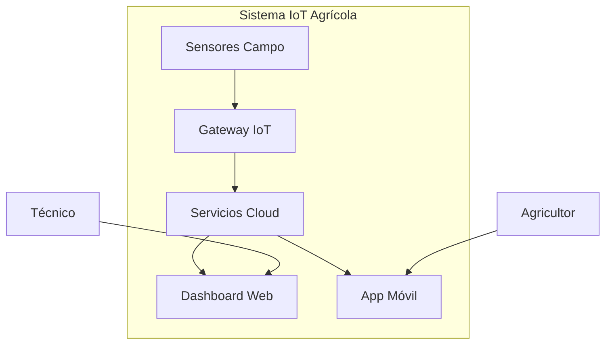

# GitHub Visualization Guide
# Guía de Visualización en GitHub

## Problema
GitHub no renderiza automáticamente los diagramas PlantUML en archivos Markdown (.md). Los bloques de código `plantuml` se muestran como texto plano.

## Soluciones

### 1. Usando PlantUML Server (Recomendado)

#### Paso 1: Codificar el diagrama
Visita: http://www.plantuml.com/plantuml/uml/
Pega tu código PlantUML y obtén la URL generada.

#### Paso 2: Usar la URL en Markdown
```markdown

```

### 2. Usando Mermaid (Alternativa nativa)

GitHub soporta Mermaid nativamente. Ejemplo:



### 3. Exportar como Imágenes

#### Opción A: VS Code
1. Instala extensión "PlantUML"
2. Abre archivo .puml
3. Usa `Ctrl+Shift+P` → "PlantUML: Export Current File Diagrams"
4. Sube la imagen al repositorio

#### Opción B: PlantUML JAR
```bash
java -jar plantuml.jar -tsvg diagram.puml
```

### 4. Usando GitHub Actions (Automático)

Crea `.github/workflows/plantuml.yml`:

```yaml
name: Generate PlantUML Diagrams
on:
  push:
    paths: ['**/*.puml']
jobs:
  plantuml:
    runs-on: ubuntu-latest
    steps:
    - uses: actions/checkout@v2
    - name: Generate PlantUML
      uses: grassedge/generate-plantuml-action@v1.5
      with:
        path: .
        message: "Update PlantUML diagrams"
      env:
        GITHUB_TOKEN: ${{ secrets.GITHUB_TOKEN }}
```

## Recomendación Final

Para esta guía IoT, recomendamos:

1. **Desarrollo local**: VS Code + PlantUML Extension
2. **Documentación GitHub**: Exportar imágenes PNG/SVG
3. **Diagramas simples**: Usar Mermaid cuando sea posible
4. **Colaboración**: Mantener archivos .puml para edición

## Ejemplo Completo

### Archivo: smart-farm-context.puml
```plantuml
@startuml
!include https://raw.githubusercontent.com/plantuml-stdlib/C4-PlantUML/master/C4_Context.puml

title Sistema Smart Farm - Contexto

Person(farmer, "Agricultor")
System(smart_farm, "Sistema Smart Farm")
System_Ext(weather, "API Clima")

Rel(farmer, smart_farm, "Monitorea")
Rel(smart_farm, weather, "Consulta")
@enduml
```

### En Markdown:
```markdown
## Diagrama de Contexto


Código fuente: [smart-farm-context.puml](./smart-farm-context.puml)
```

Este enfoque mantiene tanto el código fuente editable como la visualización correcta en GitHub.