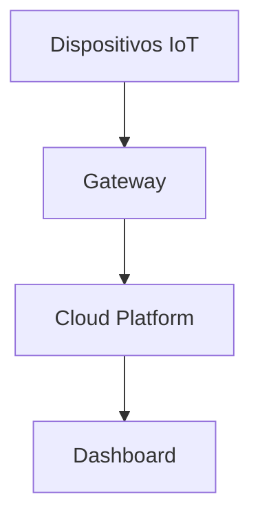

# C4 Model for IoT Systems
# Modelo C4 para Sistemas IoT

Una guía práctica especializada para crear diagramas de arquitectura IoT usando el modelo C4 de Simon Brown, adaptado específicamente para las complejidades de Internet de las Cosas.

## ¿Por qué C4 para IoT?
## Why C4 for IoT?

Los sistemas IoT presentan desafíos únicos que requieren una documentación arquitectónica especializada:

- **Ecosistemas complejos**: Dispositivos, gateways, edge computing, cloud
- **Conectividad diversa**: MQTT, LoRaWAN, Sigfox, WiFi, Cellular
- **Procesamiento distribuido**: Edge computing, fog computing, cloud computing
- **Restricciones de recursos**: Energía, ancho de banda, capacidad de procesamiento

El modelo C4 adaptado para IoT muestra estos niveles de abstracción:

- **Context (Contexto)**: Ecosistema IoT completo y stakeholders
- **Containers (Contenedores)**: Dispositivos, gateways, servicios cloud y aplicaciones
- **Components (Componentes)**: Módulos internos de firmware, servicios y aplicaciones
- **Code (Código)**: Implementación específica de algoritmos IoT críticos

## Estructura de esta Guía

### 📁 Archivos incluidos:

1. **[01-Context-Diagram.md](./01-Context-Diagram.md)** - Diagrama de Contexto IoT ✅
2. **[02-Container-Diagram.md](./02-Container-Diagram.md)** - Diagrama de Contenedores IoT ✅
3. **[03-Component-Diagram.md](./03-Component-Diagram.md)** - Diagrama de Componentes IoT ✅
4. **[04-Code-Diagram.md](./04-Code-Diagram.md)** - Diagrama de Código IoT ✅
5. **[05-IoT-Examples.md](./05-IoT-Examples.md)** - Ejemplos específicos para IoT ✅
6. **[GitHub-Visualization.md](./GitHub-Visualization.md)** - 🔧 **Guía para visualizar en GitHub**

### 🎨 **Tipos de diagramas Mermaid incluidos:**
- **Flowchart**: Para contexto y flujos de contenedores
- **Graph**: Para arquitecturas distribuidas IoT
- **Class Diagram**: Para diagramas de código
- **State Diagram**: Para máquinas de estado de dispositivos
- **Sequence Diagram**: Para protocolos de comunicación IoT

> ✅ **Todos los niveles usan Mermaid exclusivamente**
> - ✅ Renderizado automático en GitHub
> - ✅ Sintaxis simple y mantenible
> - ✅ Orientación específica para sistemas IoT
> - ✅ Colaboración sin herramientas externas

## Herramienta Principal: Mermaid

### 🎯 **¿Por qué Mermaid para IoT?**
- **Soporte nativo en GitHub**: Se renderiza automáticamente sin configuración
- **Sintaxis simple**: Fácil de escribir y mantener
- **Flexibilidad**: Soporta múltiples tipos de diagramas (flowcharts, sequence, class, state)
- **Colaborativo**: Editable directamente en archivos Markdown
- **Sin dependencias**: No requiere servidores externos

### 🛠️ **Herramientas de Desarrollo:**
- **VS Code + Mermaid Preview**: Extension para preview en tiempo real
- **Mermaid Live Editor**: https://mermaid.live/ para pruebas rápidas
- **GitHub**: Renderizado automático en README y documentación
- **GitLab**: Soporte nativo similar a GitHub

### 🎨 **Herramientas Complementarias:**
- **Draw.io (diagrams.net)**: Para diagramas muy complejos o presentaciones
- **Excalidraw**: Para sketches y wireframes colaborativos
- **Lucidchart**: Para documentación empresarial formal

## 🔧 Configuración para GitHub

### ✅ **Ventaja: Mermaid funciona nativamente en GitHub**

GitHub renderiza automáticamente los diagramas Mermaid sin configuración adicional:

```markdown

```

### 🚀 **Workflow recomendado:**
1. **Desarrollo**: VS Code + Mermaid Preview extension
2. **Colaboración**: Editar directamente en GitHub
3. **Presentaciones**: Exportar desde Mermaid Live Editor
4. **Documentación**: Todo en Markdown con bloques Mermaid

## Principios Clave

### ✅ **Buenas Prácticas:**
- Mantener consistencia en colores y símbolos
- Usar títulos descriptivos y claros
- Incluir leyendas cuando sea necesario
- Actualizar diagramas cuando cambie la arquitectura
- Usar diferentes niveles de detalle según la audiencia

### ❌ **Errores Comunes:**
- Mezclar niveles de abstracción en un mismo diagrama
- Incluir demasiado detalle en niveles altos
- No actualizar diagramas cuando cambia el código
- Crear diagramas sin propósito claro

## Flujo de Trabajo Recomendado

1. **Comenzar con el Contexto** → Entender el panorama general
2. **Definir Contenedores** → Identificar aplicaciones principales
3. **Detallar Componentes** → Para contenedores complejos
4. **Diagramas de Código** → Solo cuando sea necesario

## Beneficios Específicos para IoT

Los diagramas C4 son especialmente útiles para sistemas IoT porque permiten:

- **Mapear ecosistemas complejos**: Desde sensores hasta dashboards finales
- **Visualizar flujos de datos**: Trazabilidad completa de información IoT
- **Planificar conectividad**: Protocolos, gateways y patrones de comunicación
- **Gestionar recursos**: Identificar limitaciones de energía, ancho de banda y procesamiento
- **Documentar seguridad**: Capas de protección y puntos de vulnerabilidad
- **Facilitar mantenimiento**: Localización rápida de componentes para troubleshooting
- **Escalar arquitecturas**: Desde PoC hasta despliegues masivos industriales

## Patrones Arquitectónicos IoT Comunes

### � **Device-Gateway-Cloud Pattern**
```
Sensores → Gateway IoT → Edge Processing → Cloud Services → User Apps
```

### 📊 **Lambda Architecture for IoT**
```
Streaming Data → Real-time Processing (Storm/Kafka) → Fast Layer
              → Batch Processing (Spark) → Batch Layer
              → Serving Layer → Dashboards
```

### 🌐 **Multi-Protocol Edge Gateway**
```
LoRaWAN Devices → Gateway → MQTT → Cloud
WiFi Devices → Gateway → HTTP → Cloud  
Modbus PLCs → Gateway → OPC-UA → Cloud
```

### ⚡ **Event-Driven IoT Architecture**
```
Devices → MQTT Broker → Event Processors → Rule Engines → Actions
```

---

**💡 Consejo para IoT**: Comienza siempre por mapear el ecosistema físico (dispositivos, ubicaciones, conectividad) antes de diseñar la arquitectura software.

¡Explora cada archivo de esta guía para aprender a crear diagramas C4 específicamente optimizados para sistemas IoT!